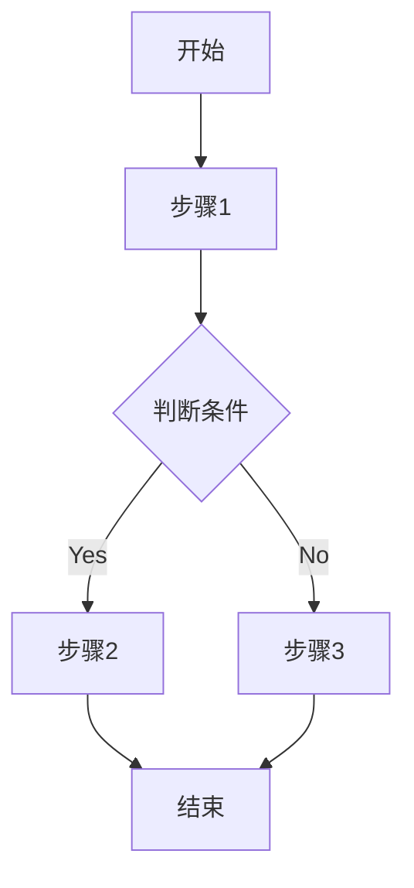
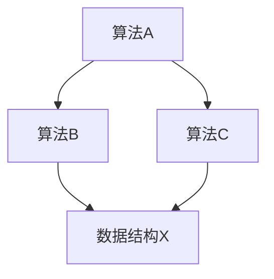
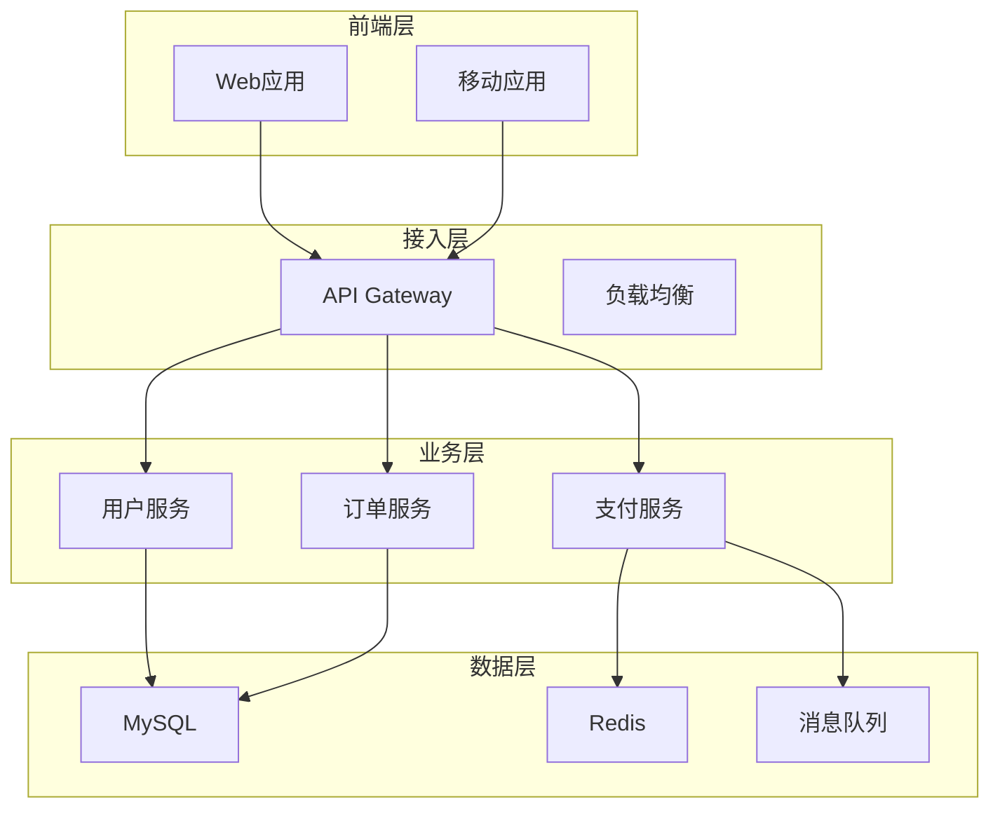

# 源代码解构（设计）

<HARD-GATE>
完整全面，不遗漏细节。
</HARD-GATE>

## 代码解构流程

**核心原则**：完整解构设计，过大的文档可进行进一步拆解

1. 读取所有源代码，感知项目目的/意图/结构，以及代码之间关系
2. 定位若干核心类，生成主干类图，格式: `plantuml`，写入 `docs/deconstruct/classes_graph.puml`
3. 定位核心数据流，生成数据流图，格式: `plantuml` 和 `markdown+mermaid` 双格式，写入 `docs/deconstruct/core_data_flow.puml(md)`
4. 将代码结构分模块编写设计细节文档，格式: `markdown`，可辅以 `mermaid`，写入 `docs/deconstruct/design_{package}/design.md`
5. 分析内存使用代价、探测是否存在内存泄漏，生成内存使用文档，写入 `docs/deconstruct/memory_usage.md`
6. 对核心算法、数据结构、算法实现，生成算法文档，格式: `markdown`，可辅以 `mermaid`，写入 `docs/deconstruct/algorithm_{package}/algorithm.md`
7. 对重要的架构设计，总结归纳，写入 `docs/deconstruct/arch_design_summary.md`
8. 汇总所有模块的设计细节后，写出全项目设计细节文档，格式: `markdown`，可辅以 `mermaid`，写入 `docs/deconstruct/global_design.md`

## 数据库解构流程

### 1. 扫描数据库相关文件

扫描以下文件类型：
- SQL 文件：`*.sql`
- iBATIS 映射文件：`**/sqlmap*.xml`、`**/*SqlMap.xml`
- MyBatis 映射文件：`**/*Mapper.xml`、`**/*map.xml`
- 代码内部内嵌的 SQL 语句，可能存在拼接

### 2. 构建数据库详细清单

生成数据库清单文档，写入 `docs/deconstruct/database/` 目录：

```
docs/deconstruct/database/
├── database_inventory.md    # 数据库清单总览
├── tables/                   # 表结构详情
│   ├── table_{table_name}.md
│   └── ...
├── indexes/                  # 索引清单
│   └── indexes.md
└── constraints/              # 约束清单
    └── constraints.md
```

清单内容包括：
- 数据库基本信息（名称、字符集、排序规则）
- 表清单（表名、注释、记录数估算）
- 字段清单（字段名、类型、长度、是否可空、默认值、注释）
- 索引清单（索引名、表名、字段、类型）
- 外键约束清单

### 3. 构建 ER 图

生成实体关系图，双格式输出：
- PlantUML 格式：`docs/deconstruct/database/er_diagram.puml`
- Markdown+Mermaid 格式：`docs/deconstruct/database/er_diagram.md`

必要时，可调度 skill `/plantuml-skill` 和 `/creating-mermaid-diagrams` 生成图片，嵌入 markdown 文档中

ER 图要求：
- 展示所有表及其字段
- 标注主键、外键关系
- 显示一对一、一对多、多对多关系
- 使用中文注释表名和字段名

### 4. 数据库设计思路摘要

生成数据库设计文档，写入 `docs/deconstruct/database/database_design.md`，包括：

- **设计思路**：整体数据库设计理念、范式遵循情况
- **典型数据类型**：
  - 主键设计（自增/UUID/雪花算法等）
  - 时间字段类型（DATE/DATETIME/TIMESTAMP）
  - 大文本字段（TEXT/CLOB/JSON）
  - 金额字段（DECIMAL 精度设计）
  - 枚举字段（ENUM/字典表）
- **命名规范**：表名、字段名命名风格
- **分库分表策略**：如有
- **数据迁移历史**：从 Flyway/Liquibase 脚本推断

## 源代码类型

### 直接源码文件

| 类型 | 文件扩展名 | 说明 |
|------|------------|------|
| Java | `*.java` | Java源码 |
| Python | `*.py` | Python源码 |
| C++ | `*.cpp *.hpp *.cxx *.hxx` | C++源码和头文件 |
| ANSI C | `*.c *.h` | C源码和头文件 |
| JavaScript | `*.js *.mjs *.cjs` | JavaScript源码 |
| TypeScript | `*.ts *.tsx *.mts *.cts` | TypeScript源码 |
| Rust | `*.rs` | Rust源码 |
| Go | `*.go` | Go源码 |
| Kotlin | `*.kt *.kts` | Kotlin源码 |
| Scala | `*.scala *.sc` | Scala源码 |
| Shell | `*.sh *.bash *.zsh` | Shell脚本 |
| Batch | `*.bat *.cmd *.ps1` | Windows脚本 |

### SQL 来源（需拼接提取）

| 来源类型 | 文件/位置 | 提取方法 |
|----------|-----------|----------|
| SQL文件 | `*.sql` | 直接读取 |
| MyBatis Mapper | `**/*Mapper.xml **/*mapper.xml` | 从 `<sql>` `<select>` `<insert>` `<update>` `<delete>` 标签提取 |
| iBATIS SqlMap | `**/*SqlMap.xml **/sqlmap*.xml` | 从 SQL 标签提取 |
| Hibernate HQL | `*.java` | 从 `@NamedQuery` 注解、HQL字符串提取 |
| JPA SQL | `*.java` | 从 `@Query` 注解提取 |
| Java字符串SQL | `*.java` | 从字符串常量、方法内SQL拼接提取 |
| Python SQL | `*.py` | 从字符串、SQLAlchemy语句提取 |
| 内嵌SQL | 各种源码 | 正则匹配SQL关键字模式 |

### SQL 拼接提取规则

```python
# 伪代码示例：提取散落的SQL

# 1. MyBatis Mapper 提取
def extract_mybatis_sql(xml_file):
    # 提取 <sql id="xxx"> 内容
    # 提取 <select/insert/update/delete> 内容
    # 合并 <include refid="xxx"> 引用
    # 替换 ${param} 和 #{param} 参数占位符

# 2. Java字符串SQL提取
def extract_java_sql(java_file):
    # 匹配模式："SELECT ..." 或 "INSERT ..." 
    # 匹配模式：String sql = "..."; 
    # 拼接多行字符串：sql += "..."
    # 提取 StringBuilder.append("...") 拼接

# 3. 注解SQL提取
def extract_annotation_sql(java_file):
    # @Query("SELECT ...")
    # @NamedQuery(name="xxx", query="SELECT ...")
```

### SQL 提取正则模式

```regex
# SQL关键字匹配（大小写无关）
(?i)(SELECT|INSERT|UPDATE|DELETE|CREATE|ALTER|DROP|TRUNCATE)\s+

# MyBatis SQL标签
<sql[^>]*id="([^"]+)"[^>]*>(.*?)</sql>
<select[^>]*>(.*?)</select>

# Java字符串SQL（大小写无关）
(?i)"(SELECT|INSERT|UPDATE|DELETE)[^"]*"
(?i)String\s+\w+\s*=\s*"([^"]*(?:SELECT|INSERT|UPDATE|DELETE)[^"]*)"

# Python字符串SQL（大小写无关）
(?i)""".*(?:SELECT|INSERT|UPDATE|DELETE).*"""
(?i)'.*(?:SELECT|INSERT|UPDATE|DELETE).*'

# 多语言通用SQL匹配（大小写无关）
(?i)(SELECT|INSERT|UPDATE|DELETE|CREATE|ALTER|DROP)\s+[\w\s\*,\.\(\)]+(FROM|INTO|TABLE|SET|VALUES|WHERE|JOIN|ORDER|GROUP|HAVING)
```

**注意**：`(?i)` 标记表示大小写无关（case-insensitive）匹配

## 内存使用分析流程

### 1. 内存热点识别

从代码中识别内存使用热点：

| 热点类型 | 识别方法 | 关注点 |
|----------|----------|--------|
| 大对象创建 | 对象实例化分析 | 单次创建超过1KB的对象 |
| 集合操作 | List/Map/Set操作 | 大容量集合初始化 |
| 字符串处理 | 字符串拼接/转换 | 循环中字符串操作 |
| 字节数组 | byte[]操作 | 大数组分配 |
| 流处理 | Stream/Reader操作 | 未及时关闭的流 |
| 缓存对象 | 缓存实现 | 无限增长的缓存 |
| 反射对象 | Class/Method缓存 | 反射结果未缓存 |

### 2. 内存泄漏探测

识别潜在的内存泄漏：

| 泄漏类型 | 代码特征 | 风险等级 |
|----------|----------|----------|
| 静态集合增长 | `static List/Map` 无限添加 | 高 |
| ThreadLocal未清理 | `ThreadLocal` 未 remove | 高 |
| 监听器未注销 | 事件监听器未移除 | 中 |
| 连接未关闭 | Connection/Stream 未关闭 | 高 |
| 缓存无过期 | 缓存无淘汰策略 | 中 |
| 内部类引用 | 非静态内部类持有外部类引用 | 中 |
| 单例持有引用 | 单例持有大对象引用 | 中 |

### 3. 内存使用代价分析

分析关键代码路径的内存代价：

```markdown
## 内存代价分析示例

### 对象创建代价

| 对象类型 | 单次内存 | 创建频率 | 月内存流量 | 优化建议 |
|----------|----------|----------|------------|----------|
| UserDTO | 512B | 100万次/天 | 15GB/月 | 使用对象池 |
| OrderVO | 1KB | 50万次/天 | 15GB/月 | 简化字段 |
| ReportPDF | 10MB | 100次/天 | 30GB/月 | 流式生成 |

### 集合内存代价

| 集合类型 | 容量 | 内存占用 | 扩容代价 | 优化建议 |
|----------|------|----------|----------|----------|
| ArrayList | 10万 | 400KB | 扩容50% | 预设容量 |
| HashMap | 10万 | 2MB | 扩容2倍 | 预设容量 |
| LinkedList | 10万 | 600KB | 无扩容 | 改用ArrayList |
```

### 4. 内存使用文档结构

文件：`docs/deconstruct/memory_usage.md`

```markdown
# 内存使用分析报告

## 项目概述
[项目名称、技术栈、运行环境]

## 内存热点清单

### 热点对象
| 序号 | 对象类型 | 创建位置 | 单次内存 | 创建频率 | 累计流量 |
|------|----------|----------|----------|----------|----------|

### 热点集合
| 序号 | 集合类型 | 使用位置 | 平均容量 | 内存占用 | 扩容频率 |
|------|----------|----------|----------|----------|----------|

### 热点操作
| 序号 | 操作类型 | 代码位置 | 内存峰值 | 执行频率 | 影响范围 |
|------|----------|----------|----------|----------|----------|

## 内存泄漏风险

### 高风险项
| 序号 | 泄漏类型 | 代码位置 | 风险描述 | 影响程度 | 修复建议 |
|------|----------|----------|----------|----------|----------|

### 中风险项
| 序号 | 泄漏类型 | 代码位置 | 风险描述 | 影响程度 | 修复建议 |
|------|----------|----------|----------|----------|----------|

### 低风险项
| 序号 | 泄漏类型 | 代码位置 | 风险描述 | 影响程度 | 修复建议 |
|------|----------|----------|----------|----------|----------|

## 内存代价分析

### 关键路径内存代价
| 路径名称 | 内存峰值 | 持续时间 | 调用频率 | 月流量估算 |
|----------|----------|----------|----------|------------|

### 对象创建代价明细
[详见内存代价分析示例]

## 内存优化建议

### 立即优化（高优先级）
| 序号 | 问题 | 优化方案 | 预期收益 | 实施成本 |
|------|------|----------|----------|----------|

### 后续优化（中优先级）
| 序号 | 问题 | 优化方案 | 预期收益 | 实施成本 |
|------|------|----------|----------|----------|

### 建议优化（低优先级）
| 序号 | 问题 | 优化方案 | 预期收益 | 实施成本 |
|------|------|----------|----------|----------|

## 内存测试建议

### 测试场景
| 序号 | 场景名称 | 目标 | 验证方法 |
|------|----------|------|----------|

### 监控指标
| 指标名称 | 预期值 | 告警阈值 | 监控方式 |
|----------|--------|----------|----------|

## 附录

### 内存分析工具
- Java: MAT, JProfiler, async-profiler
- Python: memory_profiler, tracemalloc
- C++: Valgrind, AddressSanitizer
- Rust: heaptrack

### 内存测试方法
- 压测工具: JMeter, Gatling
- 内存采样: jstat, jmap
- GC分析: GC日志, JConsole
```

---

## 算法文档流程

### 1. 核心算法识别

从代码中识别核心算法：

| 算法类型 | 识别特征 | 关注点 |
|----------|----------|--------|
| 搜索算法 | find/search/lookup | 时间复杂度、数据规模 |
| 排序算法 | sort/order/rank | 时间复杂度、稳定性 |
| 加密算法 | encrypt/decrypt/hash | 安全性、性能 |
| 压缩算法 | compress/zip/gzip | 压缩率、速度 |
| 编码算法 | encode/decode/serialize | 格式兼容性 |
| 校验算法 | validate/check/verify | 准确性、覆盖度 |
| 计算算法 | calculate/compute/aggregate | 数值精度、边界 |
| 匹配算法 | match/filter/regex | 正确性、效率 |
| 路径算法 | path/route/traverse | 最优解、完整度 |
| 分配算法 | allocate/dispatch/balance | 公平性、效率 |

### 2. 数据结构识别

从代码中识别关键数据结构：

| 数据结构 | 识别特征 | 适用场景 |
|----------|----------|----------|
| 数组/列表 | []/List/Array | 顺序存储、索引访问 |
| 链表 | Node/LinkedList | 动态插入、顺序遍历 |
| 树结构 | TreeNode/BinaryTree | 层级关系、快速查找 |
| 图结构 | Graph/Node/Edge | 网状关系、路径计算 |
| 哈希表 | Map/HashMap/Dict | 快速查找、去重 |
| 队列 | Queue/Deque | FIFO缓冲、任务队列 |
| 栈 | Stack | LIFO、递归模拟 |
| 堆 | Heap/PriorityQueue | 优先级、最小/最大值 |
| 位图 | BitSet/Bitmap | 状态压缩、快速判断 |
| 缓存 | Cache/LRU | 临时存储、命中率 |

### 3. 算法复杂度分析

分析算法的时间和空间复杂度：

```markdown
## 算法复杂度分析示例

### 排序算法分析

| 算法名称 | 时间复杂度 | 空间复杂度 | 稳定性 | 适用数据规模 |
|----------|------------|------------|--------|--------------|
| 快速排序 | O(n log n) | O(log n) | 不稳定 | 大规模数据 |
| 归并排序 | O(n log n) | O(n) | 稳定 | 大规模数据 |
| 冒泡排序 | O(n²) | O(1) | 稳定 | 小规模数据 |
| 堆排序 | O(n log n) | O(1) | 不稳定 | 大规模数据 |

### 搜索算法分析

| 算法名称 | 时间复杂度 | 空间复杂度 | 适用场景 | 优化方向 |
|----------|------------|------------|----------|----------|
| 顺序查找 | O(n) | O(1) | 无序数据 | 建索引 |
| 二分查找 | O(log n) | O(1) | 有序数据 | 预排序 |
| 哈希查找 | O(1) | O(n) | 精确匹配 | 扩容策略 |
| 树查找 | O(log n) | O(n) | 范围查询 | 平衡树 |
```

### 4. 算法文档结构

文件：`docs/deconstruct/algorithm_{package}/algorithm.md`

```markdown
# {模块名称} 算法文档

## 模块概述
[模块简介、算法类型、核心功能]

## 核心算法

### 算法1: {算法名称}

#### 算法描述
[算法目的、解决的问题]

#### 输入输出
| 输入参数 | 类型 | 说明 | 约束条件 |
|----------|------|------|----------|
| param1 | Type | ... | ... |

| 输出结果 | 类型 | 说明 |
|----------|------|------|
| result | Type | ... |

#### 算法流程


#### 复杂度分析
| 维度 | 复杂度 | 说明 |
|------|--------|------|
| 时间复杂度 | O(...) | 最佳/平均/最差 |
| 空间复杂度 | O(...) | 内存占用 |

#### 代码实现
[核心代码片段，含关键注释]

```java
public Result algorithm(Param param) {
    // 步骤1: 初始化
    // 步骤2: 核心逻辑
    // 步骤3: 返回结果
}
```

#### 优化方向
| 序号 | 问题 | 优化方案 | 预期收益 |
|------|------|----------|----------|

#### 边界条件
| 边界情况 | 处理方式 | 测试用例 |
|----------|----------|----------|

### 算法2: {算法名称}
...

## 核心数据结构

### 数据结构1: {结构名称}

#### 结构描述
[结构用途、设计原因]

#### 结构定义
[数据结构定义，含字段说明]

#### 操作方法
| 方法名称 | 操作类型 | 时间复杂度 | 说明 |
|----------|----------|------------|------|

#### 使用场景
[在哪些算法中使用]

#### 内存分析
| 容量 | 内存占用 | 扩容策略 |
|------|----------|----------|

### 数据结构2: {结构名称}
...

## 算法复杂度汇总

| 算法名称 | 时间复杂度 | 空间复杂度 | 数据规模限制 |
|----------|------------|------------|--------------|

## 算法依赖关系



## 性能基准

| 算法名称 | 测试数据规模 | 执行时间 | 内存峰值 | 测试环境 |
|----------|--------------|----------|----------|----------|

## 算法优化建议

| 序号 | 算法 | 当前问题 | 优化方案 | 预期收益 |
|------|------|----------|----------|----------|

## 附录

### 相关文档
- 设计文档：`docs/deconstruct/design_{package}/design.md`
- 内存分析：`docs/deconstruct/memory_usage.md`
```

---

## 架构设计总结流程

### 1. 架构设计识别

从代码中识别关键架构设计：

| 架构模式 | 识别特征 | 关注点 |
|----------|----------|--------|
| 分层架构 | Controller/Service/DAO | 层次划分、职责边界 |
| MVC架构 | Model/View/Controller | 模块职责、交互方式 |
| 微服务架构 | Service/API/Gateway | 服务拆分、通信方式 |
| 事件驱动 | Event/Listener/Handler | 事件类型、处理链 |
| 管道过滤 | Filter/Pipeline/Chain | 过滤步骤、数据流 |
| 插件架构 | Plugin/Extension/Hook | 插件接口、加载机制 |
| 代理架构 | Proxy/Delegate/Wrapper | 代理目的、转发逻辑 |
| 适配器架构 | Adapter/Converter/Mapper | 适配接口、转换规则 |
| 工厂架构 | Factory/Builder/Creator | 创建逻辑、扩展点 |
| 单例架构 | Singleton/Instance | 实例管理、线程安全 |

### 2. 设计模式识别

从代码中识别关键设计模式：

| 设计模式 | 识别特征 | 适用场景 |
|----------|----------|----------|
| 策略模式 | Strategy/Context | 多种算法切换 |
| 工厂模式 | Factory/create | 对象创建解耦 |
| 观察者模式 | Observer/Listener | 事件通知机制 |
| 装饰器模式 | Decorator/Wrap | 功能增强叠加 |
| 适配器模式 | Adapter/Impl | 接口转换适配 |
| 代理模式 | Proxy | 访问控制、延迟加载 |
| 模板方法 | Template/Abstract | 流程骨架复用 |
| 命令模式 | Command/Execute | 操作封装解耦 |
| 责任链模式 | Chain/Handler | 处理步骤串联 |
| 状态模式 | State/Context | 状态驱动行为 |

### 3. 架构设计评估

评估架构设计的优劣：

```markdown
## 架构设计评估示例

### 分层架构评估

| 评估维度 | 当前状态 | 评分(1-5) | 问题描述 | 改进建议 |
|----------|----------|-----------|----------|----------|
| 层次清晰度 | 明确 | 4 | DAO层偶有业务逻辑 | 严格边界 |
| 职责单一性 | 良好 | 4 | Service偶有跨层调用 | 规范约束 |
| 扩展灵活性 | 一般 | 3 | 新增层需要大量修改 | 引入中间层 |
| 依赖合理性 | 良好 | 4 | 无循环依赖 | 保持现状 |
| 测试友好性 | 良好 | 4 | Mock容易 | 保持现状 |

### 设计模式评估

| 模式名称 | 使用位置 | 使用合理性 | 问题 | 替代方案 |
|----------|----------|------------|------|----------|
| 策略模式 | 支付模块 | 合理 | - | - |
| 单例模式 | 配置管理 | 过度使用 | 多处滥用 | 改用依赖注入 |
| 工厂模式 | DAO创建 | 合理 | - | - |
| 观察者模式 | 事件通知 | 合理 | 监听器过多 | 简化监听链 |
```

### 4. 架构设计文档结构

文件：`docs/deconstruct/arch_design_summary.md`

```markdown
# 架构设计总结

## 项目概述
[项目名称、技术栈、架构类型]

## 架构全景图



## 核心架构模式

### 模式1: {架构名称}

#### 模式描述
[模式定义、选择原因]

#### 架构图
```mermaid
graph TD
    [详细架构图]
```

#### 核心组件
| 组件名称 | 职责 | 依赖 | 接口 |

#### 设计决策
| 决策点 | 选择方案 | 选择理由 | 替代方案 |

#### 优缺点分析
| 维度 | 优点 | 缺点 |

#### 适用场景
[适用场景描述]

### 模式2: {架构名称}
...

## 关键设计模式

### 设计模式汇总
| 模式名称 | 使用位置 | 使用频率 | 合理性评分 |

### 设计模式详情

#### 模式1: {模式名称}
| 项目 | 内容 |
|------|------|
| 使用位置 | ... |
| 实现方式 | ... |
| 解决问题 | ... |
| 使用评估 | ... |
| 改进建议 | ... |

#### 模式2: {模式名称}
...

## 架构设计评估

### 整体评估
| 评估维度 | 当前状态 | 评分(1-5) | 问题描述 | 改进建议 |
|----------|----------|-----------|----------|----------|
| 模块划分 | ... | ... | ... | ... |
| 职责边界 | ... | ... | ... | ... |
| 扩展能力 | ... | ... | ... | ... |
| 性能设计 | ... | ... | ... | ... |
| 安全设计 | ... | ... | ... | ... |
| 可观测性 | ... | ... | ... | ... |

### 各层评估
[详见架构设计评估示例]

## 架构演进历史

### 版本1.0
| 时间 | 架构特点 | 主要问题 | 改进方向 |

### 版本2.0
| 时间 | 架构特点 | 主要改进 | 遗留问题 |

### 当前版本
| 时间 | 架构特点 | 当前状态 | 未来规划 |

## 架构设计决策记录

### ADR-001: {决策名称}
| 项目 | 内容 |
|------|------|
| 状态 | 已采纳/已废弃/待讨论 |
| 决策日期 | YYYY-MM-DD |
| 决策背景 | ... |
| 决策内容 | ... |
| 决策理由 | ... |
| 替代方案 | ... |
| 后果影响 | ... |

### ADR-002: {决策名称}
...

## 架构风险识别

| 风险类型 | 风险描述 | 影响范围 | 风险等级 | 缓解措施 |
|----------|----------|----------|----------|----------|

## 架构优化建议

### 短期优化
| 序号 | 优化项 | 优化方案 | 预期收益 | 实施优先级 |

### 中期优化
| 序号 | 优化项 | 优化方案 | 预期收益 | 实施优先级 |

### 长期优化
| 序号 | 优化项 | 优化方案 | 预期收益 | 实施优先级 |

## 附录

### 相关文档
- 全局设计文档：`docs/deconstruct/global_design.md`
- 数据库设计：`docs/deconstruct/database/database_design.md`
- 算法文档：`docs/deconstruct/algorithm_*/algorithm.md`

### 技术选型参考
| 技术栈 | 选择理由 | 替代方案 |
|----------|----------|----------|
```

---

## 输出目录结构

```
docs/deconstruct/
├── classes_graph.puml              # 主干类图
├── core_data_flow.puml             # 数据流图
├── core_data_flow.md               # 数据流图
├── global_design.md                # 全局设计文档
├── memory_usage.md                 # 内存使用分析
├── arch_design_summary.md          # 架构设计总结
├── database/                       # 数据库解构输出
│   ├── database_inventory.md       # 数据库清单
│   ├── er_diagram.puml             # ER图
│   ├── er_diagram.md               # ER图
│   ├── database_design.md          # 数据库设计思路
│   ├── tables/                     # 表结构详情
│   ├── indexes/                    # 索引清单
│   └── constraints/                # 约束清单
├── design_{package}/               # 分模块设计文档
│   └── design.md
└── algorithm_{package}/            # 分模块算法文档
    └── algorithm.md
```

## 关联技能

需求收集请使用技能：`requirement-collect`

