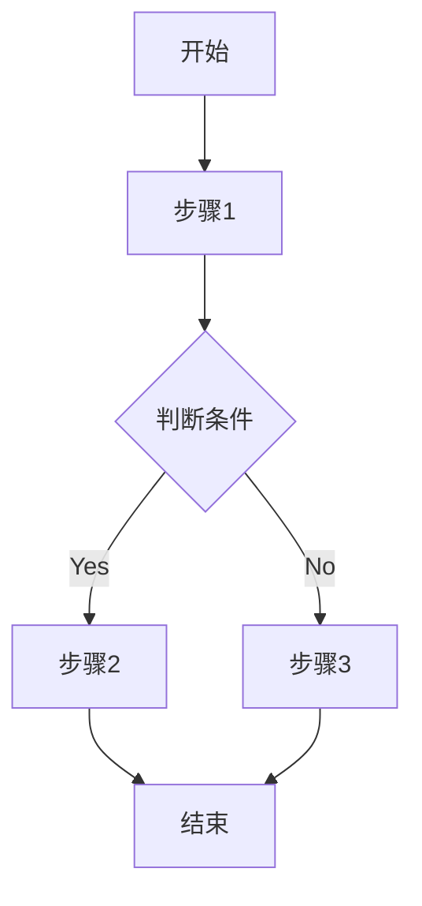
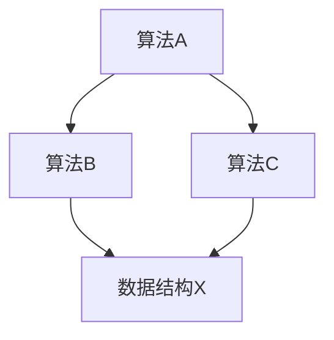

# {模块名称} 算法文档

## 模块概述

[模块简介、算法类型、核心功能]

## 核心算法

### 算法1: {算法名称}

#### 算法描述

[算法目的、解决的问题]

#### 输入输出

| 输入参数 | 类型 | 说明 | 约束条件 |
| -------- | ---- | ---- | -------- |

| 输出结果 | 类型 | 说明 |
| -------- | ---- | ---- |

#### 算法流程

#### 复杂度分析

| 维度 | 复杂度 | 说明 |
| ---- | ------ | ---- |
| 时间复杂度 | O(...) | 最佳/平均/最差 |
| 空间复杂度 | O(...) | 内存占用 |

#### 代码实现

[核心代码片段，含关键注释]

#### 优化方向

| 序号 | 问题 | 优化方案 | 预期收益 |
| ---- | ---- | -------- | -------- |

#### 边界条件

| 边界情况 | 处理方式 | 测试用例 |
| -------- | -------- | -------- |

## 核心数据结构

### 数据结构1: {结构名称}

#### 结构描述

[结构用途、设计原因]

#### 结构定义

[数据结构定义，含字段说明]

#### 操作方法

| 方法名称 | 操作类型 | 时间复杂度 | 说明 |
| -------- | -------- | ---------- | ---- |

#### 使用场景

[在哪些算法中使用]

#### 内存分析

| 容量 | 内存占用 | 扩容策略 |
| ---- | -------- | -------- |

## 算法复杂度汇总

| 算法名称 | 时间复杂度 | 空间复杂度 | 数据规模限制 |
| -------- | ---------- | ---------- | ------------ |

## 算法依赖关系

## 性能基准

| 算法名称 | 测试数据规模 | 执行时间 | 内存峰值 | 测试环境 |
| -------- | ------------ | -------- | -------- | -------- |

## 算法优化建议

| 序号 | 算法 | 当前问题 | 优化方案 | 预期收益 |
| ---- | ---- | -------- | -------- | -------- |
