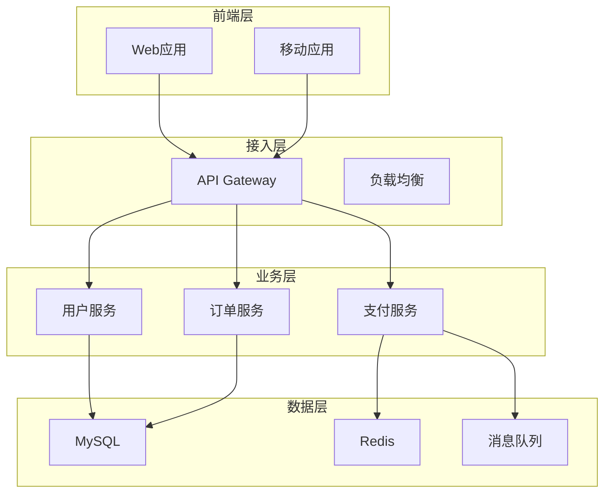

# 架构设计总结

## 项目概述

[项目名称、技术栈、架构类型]

## 架构全景图

## 核心架构模式

### 模式1: {架构名称}

#### 模式描述

[模式定义、选择原因]

#### 核心组件

| 组件名称 | 职责 | 依赖 | 接口 |
| -------- | ---- | ---- | ---- |

#### 设计决策

| 决策点 | 选择方案 | 选择理由 | 替代方案 |
| ------ | -------- | -------- | -------- |

#### 优缺点分析

| 维度 | 优点 | 缺点 |
| ---- | ---- | ---- |

## 关键设计模式

### 设计模式汇总

| 模式名称 | 使用位置 | 使用频率 | 合理性评分 |
| -------- | -------- | -------- | ---------- |

### 设计模式详情

#### 模式1: {模式名称}

| 项目 | 内容 |
| ---- | ---- |
| 使用位置 | ... |
| 实现方式 | ... |
| 解决问题 | ... |
| 使用评估 | ... |
| 改进建议 | ... |

## 架构设计评估

### 整体评估

| 评估维度 | 当前状态 | 评分(1-5) | 问题描述 | 改进建议 |
| -------- | -------- | --------- | -------- | -------- |
| 模块划分 | ... | ... | ... | ... |
| 职责边界 | ... | ... | ... | ... |
| 扩展能力 | ... | ... | ... | ... |
| 性能设计 | ... | ... | ... | ... |
| 安全设计 | ... | ... | ... | ... |
| 可观测性 | ... | ... | ... | ... |

## 架构演进历史

### 版本1.0

| 时间 | 架构特点 | 主要问题 | 改进方向 |
| ---- | -------- | -------- | -------- |

### 版本2.0

| 时间 | 架构特点 | 主要改进 | 遗留问题 |
| ---- | -------- | -------- | -------- |

### 当前版本

| 时间 | 架构特点 | 当前状态 | 未来规划 |
| ---- | -------- | -------- | -------- |

## 架构设计决策记录

### ADR-001: {决策名称}

| 项目 | 内容 |
| ---- | ---- |
| 状态 | 已采纳/已废弃/待讨论 |
| 决策日期 | YYYY-MM-DD |
| 决策背景 | ... |
| 决策内容 | ... |
| 决策理由 | ... |
| 替代方案 | ... |
| 后果影响 | ... |

## 架构风险识别

| 风险类型 | 风险描述 | 影响范围 | 风险等级 | 缓解措施 |
| -------- | -------- | -------- | -------- | -------- |

## 架构优化建议

### 短期优化

| 序号 | 优化项 | 优化方案 | 预期收益 | 实施优先级 |
| ---- | ------ | -------- | -------- | ---------- |

### 中期优化

| 序号 | 优化项 | 优化方案 | 预期收益 | 实施优先级 |
| ---- | ------ | -------- | -------- | ---------- |

### 长期优化

| 序号 | 优化项 | 优化方案 | 预期收益 | 实施优先级 |
| ---- | ------ | -------- | -------- | ---------- |
