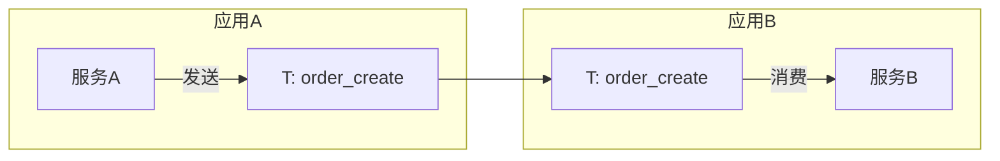

# 中间件消息追踪报告

## 项目概述

[项目名称、技术栈、中间件类型]

## 消息通道清单

### 生产者（Producer）

| 序号 | 中间件 | 通道名称 | Topic/Queue | 消息类型 | 消息体示例 | 生产频率 | 发送位置 |
| ---- | ------ | -------- | ----------- | -------- | ---------- | -------- | -------- |

### 消费者（Consumer）

| 序号 | 中间件 | 通道名称 | Topic/Queue | Group | 消息类型 | 消费频率 | 接收位置 |
| ---- | ------ | -------- | ----------- | ----- | -------- | -------- | -------- |

### 通道映射关系

| 序号 | 通道名称 | 生产者 | 消费者 | 数据流向 | 跨应用说明 |
| ---- | -------- | ------ | ------ | -------- | ---------- |

## 跨应用数据流图

## 数据流说明

### 流1: {数据流名称}

- **通道**: {Topic/Queue名称}
- **生产者**: {应用/服务} → {代码位置}
- **消费者**: {应用/服务} → {代码位置}
- **消息格式**: {消息体结构}
- **业务含义**: {该数据流对应的业务场景}
- **跨应用依赖**: {该数据流依赖的其他应用}
