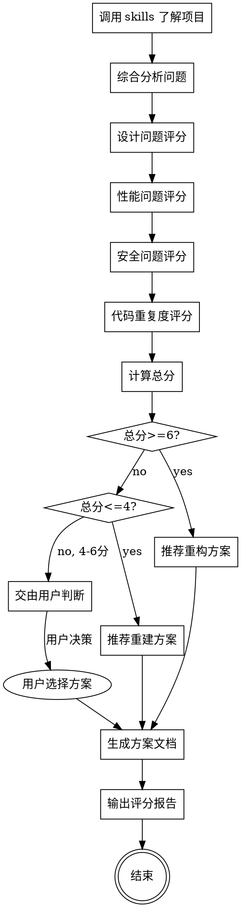

# 项目问题侦测

## 概述

综合使用多个技能对项目进行全面侦测，识别设计问题、性能问题、安全问题，为项目评分，并根据分数提出重构或重建方案。

## 执行流程



---

## Phase 1: 项目全局了解

### 1.1 调用技能

按顺序调用以下技能获取项目全局信息：

| 序号 | 技能 | 输出物 | 用途 |
|------|------|--------|------|
| 1 | `code-deconstruct` | `docs/deconstruct/*` | 了解项目结构、数据流、设计 |
| 2 | `code-review` | `docs/review/*` | 识别代码问题、数据库问题 |
| 3 | `code-detect-dup` | `docs/dup/*` | 识别代码重复度 |

### 1.2 收集信息

综合各技能输出，收集以下信息：

- **项目结构**：模块划分、依赖关系
- **设计模式**：使用的设计模式、合理性
- **代码质量**：代码风格、命名规范、注释完整性
- **性能热点**：高消耗方法、资源泄漏、并发问题
- **安全风险**：SQL注入、XSS、敏感信息泄露
- **代码重复**：重复代码块、可抽象模式
- **数据库设计**：表结构、索引、ER图

---

## Phase 2: 问题评分

### 2.1 评分维度

| 维度 | 权重 | 评分标准 |
|------|------|----------|
| **设计质量** | 30% | 0-10分 |
| **性能质量** | 25% | 0-10分 |
| **安全质量** | 20% | 0-10分 |
| **代码质量** | 15% | 0-10分 |
| **重复度** | 10% | 0-10分 |

### 2.2 设计质量评分 (30%)

| 分数 | 标准 |
|------|------|
| 8-10 | 设计清晰、模块独立、职责明确、扩展性好 |
| 6-7 | 设计合理、偶有耦合、部分模块过大 |
| 4-5 | 设计混乱、耦合严重、职责不清 |
| 0-3 | 无设计、代码堆砌、难以理解 |

**检查项：**

| 检查项 | 好的表现 | 差的表现 |
|--------|----------|----------|
| 模块划分 | 职责单一、边界清晰 | 职责混杂、边界模糊 |
| 依赖关系 | 单向依赖、无循环 | 双向依赖、循环依赖 |
| 类设计 | 单一职责、合理抽象 | 上帝类、数据类 |
| 设计模式 | 使用恰当、不过度 | 不使用或滥用 |
| 代码结构 | 嵌套<4层、方法<50行 | 嵌套>4层、方法>200行 |

### 2.3 性能质量评分 (25%)

| 分数 | 标准 |
|------|------|
| 8-10 | 性能优良、无明显瓶颈、资源管理完善 |
| 6-7 | 性能尚可、偶有瓶颈、资源管理基本合理 |
| 4-5 | 性能问题明显、多处瓶颈、资源管理欠缺 |
| 0-3 | 性能严重问题、资源泄漏、内存溢出风险 |

**检查项：**

| 检查项 | 的表现 | 差的表现 |
|--------|----------|----------|
| 高消耗方法 | 已优化、已缓存 | 未优化、反复调用 |
| 资源管理 | try-with-resources | 未关闭流/连接 |
| 并发处理 | 线程池、正确同步 | new Thread、锁问题 |
| 数据库操作 | 批量操作、分页 | 循环单条操作 |
| 缓存策略 | 合理缓存 | 无缓存或过度缓存 |

### 2.4 安全质量评分 (20%)

| 分数 | 标准 |
|------|------|
| 8-10 | 安全措施完善、无明显漏洞 |
| 6-7 | 安全措施基本到位、偶有隐患 |
| 4-5 | 安全措施欠缺、多处隐患 |
| 0-3 | 安全严重问题、存在漏洞 |

**检查项：**

| 检查项 | 的表现 | 差的表现 |
|--------|----------|----------|
| SQL注入 | 参数化查询 | 字符串拼接 SQL |
| XSS | 输入转义 | 直接拼接 HTML |
| 敏感信息 | 加密存储、不硬编码 | 硬编码密码/密钥 |
| 权限控制 | 完善校验 | 无校验或校验不足 |
| 日志安全 | 无敏感信息、无CRLF | 打印敏感信息 |

### 2.5 代码质量评分 (15%)

| 分数 | 标准 |
|------|------|
| 8-10 | 代码规范、风格统一、注释完善 |
| 6-7 | 代码基本规范、风格基本统一 |
| 4-5 | 代码不规范、风格混乱 |
| 0-3 | 代码严重不规范、难以阅读 |

**检查项：**

| 检查项 | 的表现 | 差的表现 |
|--------|----------|----------|
| 命名规范 | 有意义、统一风格 | 随意命名、风格混乱 |
| 注释 | 关键代码有注释 | 无注释或注释无效 |
| 格式 | 统一格式化 | 格式混乱 |
| 类型使用 | 正确使用泛型 | 类型不安全 |
| 异常处理 | 合理处理、有后续 | 只打日志或忽略 |

### 2.6 重复度评分 (10%)

| 分数 | 标准 |
|------|------|
| 8-10 | 重复率<5% |
| 6-7 | 重复率5-15% |
| 4-5 | 重复率15-30% |
| 0-3 | 重复率>30% |

---

## Phase 3: 计算总分

### 3.1 加权计算

```
总分 = 设计质量 × 30% + 性能质量 × 25% + 安全质量 × 20% + 代码质量 × 15% + 重复度 × 10%
```

### 3.2 评分结果解读

| 分数范围 | 状态 | 建议 |
|----------|------|------|
| 6-10分 | **可维护** | 执行重构方案，解决具体问题 |
| 4-6分 | **边缘状态** | 交由用户判断重构或重建 |
| 0-4分 | **不可维护** | 执行重建方案，重新设计 |

---

## Phase 4: 方案输出

### 4.1 重构方案文档结构

文件：`docs/refactor/refactor-{yyyymmdd}-{seq}.md`

```markdown
# 重构方案

## 项目概述
[项目名称、技术栈、规模]

## 当前状态
### 评分结果
[总分、各维度分数]

### 问题清单
| 序号 | 问题类型 | 问题描述 | 优先级 | 影响范围 |
|------|----------|----------|--------|----------|
| 1 | 设计 | ... | 高 | ... |

## 重构目标
[重构要达成的目标]

## 重构策略
### 短期重构（Phase 1）
[紧急问题修复]

### 中期重构（Phase 2）
[主要问题解决]

### 长期重构（Phase 3）
[架构优化]

## 重构步骤
### Phase 1: {阶段名称}
| 序号 | 步骤 | 修改范围 | 验证方式 | 风险评估 |
|------|------|----------|----------|----------|
| 1.1 | ... | ... | ... | ... |

### Phase 2: {阶段名称}
...

## 风险控制
### 重构风险
[可能的风险]

### 回滚策略
[如何回滚]

### 灰度策略
[如何灰度发布]

## 验收标准
[如何验证重构成功]

## 资源估算
[工作量估算]
```

### 4.2 重建方案文档结构

文件：`docs/rebuild/rebuild-{yyyymmdd}-{seq}.md`

```markdown
# 重建方案

## 项目概述
[项目名称、技术栈、规模]

## 当前状态分析
### 评分结果
[总分、各维度分数]

### 不可维护原因
[为什么需要重建而非重构]

## 重建必要性论证
### 技术债务分析
[累积的技术债务]

### 维护成本分析
[当前维护成本]

### 重建收益分析
[重建后的收益]

## 重建目标
### 功能目标
[保留的功能]

### 技术目标
[新的技术栈/架构]

### 性能目标
[性能指标]

## 重建策略
### 技术选型
[新的技术栈]

### 架构设计
[新的架构]

### 数据迁移
[数据迁移策略]

## 重建步骤
### Phase 1: 基础搭建
[搭建新项目骨架]

### Phase 2: 核心功能
[实现核心功能]

### Phase 3: 功能迁移
[迁移剩余功能]

### Phase 4: 数据迁移
[迁移数据]

### Phase 5: 切换上线
[切换到新系统]

## 风险控制
### 数据安全
[数据迁移风险控制]

### 业务连续性
[如何保证业务不中断]

### 回滚策略
[如何回滚到旧系统]

## 验收标准
[如何验证重建成功]

## 资源估算
[工作量估算]

## 时间规划
[时间安排]
```

### 4.3 评分报告文档结构

文件：`docs/detect/detect-{yyyymmdd}-{seq}.md`

```markdown
# 项目侦测报告

## 项目信息
| 项目名称 | {name} |
|----------|--------|
| 技术栈 | {tech} |
| 代码规模 | {lines} |
| 模块数量 | {modules} |
| 侦测日期 | {date} |

## 评分结果
| 维度 | 分数 | 权重 | 加权分 |
|------|------|------|--------|
| 设计质量 | {score} | 30% | {weighted} |
| 性能质量 | {score} | 25% | {weighted} |
| 安全质量 | {score} | 20% | {weighted} |
| 代码质量 | {score} | 15% | {weighted} |
| 重复度 | {score} | 10% | {weighted} |
| **总分** | **{total}** | - | **{total}** |

## 问题详情
### 设计问题
| 序号 | 问题 | 位置 | 建议 |
|------|------|------|------|

### 性能问题
| 序号 | 问题 | 位置 | 建议 |
|------|------|------|------|

### 安全问题
| 序号 | 问题 | 位置 | 建议 |
|------|------|------|------|

### 代码质量问题
| 序号 | 问题 | 位置 | 建议 |
|------|------|------|------|

### 重复代码
| 序号 | 重复位置 | 重复率 | 建议 |
|------|----------|--------|------|

## 改进建议
### 推荐方案
[重构/重建，及理由]

### 方案文档
[方案文档路径]

## 结论
[总结]
```

---

## Phase 5: 用户决策

### 5.1 4-6分项目处理

当项目评分在 4-6 分之间，交由用户判断：

```
项目评分：{score}分（边缘状态）

问题分析：
- 设计质量：{score}分 - {主要问题}
- 性能质量：{score}分 - {主要问题}
- 安全质量：{score}分 - {主要问题}
- 代码质量：{score}分 - {主要问题}
- 重复度：{score}分 - {重复率}

两种方案：
1. 重构方案：解决具体问题，保留现有架构
2. 重建方案：重新设计，彻底解决技术债务

请选择：
A. 执行重构方案
B. 执行重建方案
C. 需要更多信息再决策
```

### 5.2 用户选择处理

| 选择 | 处理 |
|------|------|
| A - 重构 | 生成重构方案文档 |
| B - 重建 | 生成重建方案文档 |
| C - 更多信息 | 提供详细分析，重新询问 |

---

## 输出物清单

| 类型 | 文件 | 说明 |
|------|------|------|
| 设计文档 | `docs/deconstruct/*` | code-deconstruct 输出 |
| 审查文档 | `docs/review/*` | code-review 输出 |
| 重复文档 | `docs/dup/*` | code-detect-dup 输出 |
| 评分报告 | `docs/detect/detect-{yyyymmdd}-{seq}.md` | 评分结果 |
| 重构方案 | `docs/refactor/refactor-{yyyymmdd}-{seq}.md` | 重构方案 |
| 重建方案 | `docs/rebuild/rebuild-{yyyymmdd}-{seq}.md` | 重建方案 |

---

## 执行检查清单

**Phase 1 检查：**
- [ ] code-deconstruct 已执行
- [ ] code-review 已执行
- [ ] code-detect-dup 已执行
- [ ] 项目全局信息已收集

**Phase 2 检查：**
- [ ] 设计质量已评分
- [ ] 性能质量已评分
- [ ] 安全质量已评分
- [ ] 代码质量已评分
- [ ] 重复度已评分
- [ ] 总分已计算

**Phase 3 检查：**
- [ ] 方案类型已确定
- [ ] 用户已确认（如需）

**Phase 4 检查：**
- [ ] 方案文档已生成
- [ ] 评分报告已输出

---

## Git 提交

```bash
git add docs/
git commit -m "docs: 项目侦测报告 {yyyymmdd}-{seq}"
```