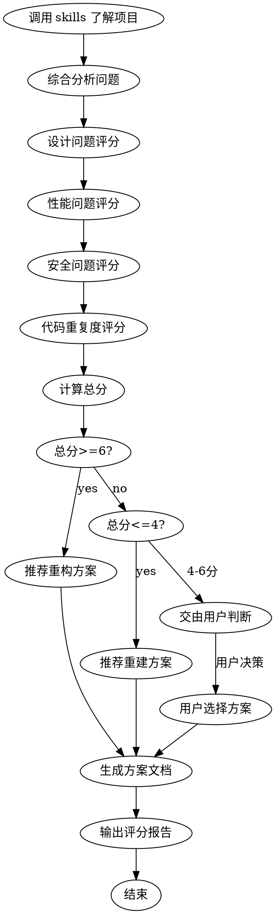

# 项目问题侦测

<HARD-GATE>
理性，客观，实际，真实，不恭维，实事求是
</HARD-GATE>

## 执行流程



---

## Phase 1: 项目全局了解

按顺序调用技能获取项目信息：

| 技能 | 输出物 | 用途 |
|------|--------|------|
| `code-deconstruct` | `docs/deconstruct/*` | 项目结构、数据流、设计 |
| `code-review` | `docs/review/*` | 代码问题、数据库问题 |
| `code-detect-dup` | `docs/dup/*` | 代码重复度 |

综合收集：项目结构、设计模式、代码质量、性能热点、安全风险、代码重复、数据库设计。

---

## Phase 2: 问题评分

### 评分维度与权重

| 维度 | 权重 | 评分范围 |
|------|------|----------|
| 设计质量 | 30% | 0-10 |
| 性能质量 | 25% | 0-10 |
| 安全质量 | 20% | 0-10 |
| 代码质量 | 15% | 0-10 |
| 重复度 | 10% | 0-10 |

### 各维度评分标准

| 分数 | 设计 | 性能 | 安全 | 代码 | 重复度 |
|------|------|------|------|------|--------|
| 8-10 | 清晰/模块独立/扩展性好 | 优良/无瓶颈/资源管理完善 | 措施完善/无漏洞 | 规范/统一/注释完善 | <5% |
| 6-7 | 合理/偶有耦合 | 尚可/偶有瓶颈 | 基本到位/偶有隐患 | 基本规范 | 5-15% |
| 4-5 | 混乱/耦合严重 | 问题明显/多处瓶颈 | 欠缺/多处隐患 | 不规范/混乱 | 15-30% |
| 0-3 | 无设计/代码堆砌 | 严重问题/资源泄漏 | 严重问题/存在漏洞 | 严重不规范 | >30% |

### 检查项

| 维度 | 好的表现 | 差的表现 |
|------|----------|----------|
| 模块划分 | 职责单一、边界清晰 | 职责混杂、边界模糊 |
| 依赖关系 | 单向依赖、无循环 | 双向依赖、循环依赖 |
| 类设计 | 单一职责、合理抽象 | 上帝类、数据类 |
| 高消耗方法 | 已优化、已缓存 | 未优化、反复调用 |
| 资源管理 | try-with-resources | 未关闭流/连接 |
| 并发处理 | 线程池、正确同步 | new Thread、锁问题 |
| 数据库操作 | 批量操作、分页 | 循环单条操作 |
| SQL注入 | 参数化查询 | 字符串拼接SQL |
| XSS | 输入转义 | 直接拼接HTML |
| 敏感信息 | 加密存储、不硬编码 | 硬编码密码/密钥 |
| 权限控制 | 完善校验 | 无校验或校验不足 |
| 命名规范 | 有意义、统一风格 | 随意命名、风格混乱 |
| 异常处理 | 合理处理、有后续 | 只打日志或忽略 |

---

## Phase 3: 计算总分

```
总分 = 设计质量×30% + 性能质量×25% + 安全质量×20% + 代码质量×15% + 重复度×10%
```

| 分数范围 | 状态 | 建议 |
|----------|------|------|
| 6-10 | 可维护 | 执行重构方案 |
| 4-6 | 边缘状态 | 交由用户判断 |
| 0-4 | 不可维护 | 执行重建方案 |

---

## Phase 4: 方案输出

使用模板生成方案文档：

| 方案 | 模板 | 输出路径 |
|------|------|----------|
| 重构 | `templates/refactor.md` | `docs/refactor/refactor-{yyyymmdd}-{seq}.md` |
| 重建 | `templates/rebuild.md` | `docs/rebuild/rebuild-{yyyymmdd}-{seq}.md` |
| 评分报告 | `templates/detect-report.md` | `docs/detect/detect-{yyyymmdd}-{seq}.md` |

---

## Phase 5: 用户决策

4-6分项目交由用户判断，提供两种方案供选择：

| 选择 | 处理 |
|------|------|
| A - 重构 | 生成重构方案文档 |
| B - 重建 | 生成重建方案文档 |
| C - 更多信息 | 提供详细分析，重新询问 |

---

## 输出物清单

| 类型 | 文件 | 说明 |
|------|------|------|
| 设计文档 | `docs/deconstruct/*` | code-deconstruct 输出 |
| 审查文档 | `docs/review/*` | code-review 输出 |
| 重复文档 | `docs/dup/*` | code-detect-dup 输出 |
| 评分报告 | `docs/detect/detect-{yyyymmdd}-{seq}.md` | 评分结果 |
| 重构方案 | `docs/refactor/refactor-{yyyymmdd}-{seq}.md` | 重构方案 |
| 重建方案 | `docs/rebuild/rebuild-{yyyymmdd}-{seq}.md` | 重建方案 |

---

## 执行检查清单

- [ ] code-deconstruct 已执行
- [ ] code-review 已执行
- [ ] code-detect-dup 已执行
- [ ] 项目全局信息已收集
- [ ] 五维度评分已完成
- [ ] 总分已计算
- [ ] 方案类型已确定（用户确认如需）
- [ ] 方案文档已生成
- [ ] 评分报告已输出

---

## Git 提交

```bash
git add docs/
git commit -m "docs: 项目侦测报告 {yyyymmdd}-{seq}"
```
