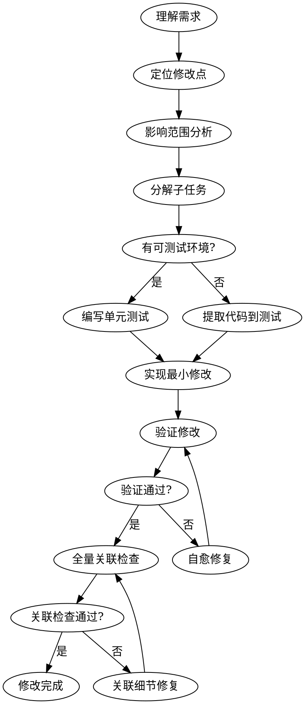
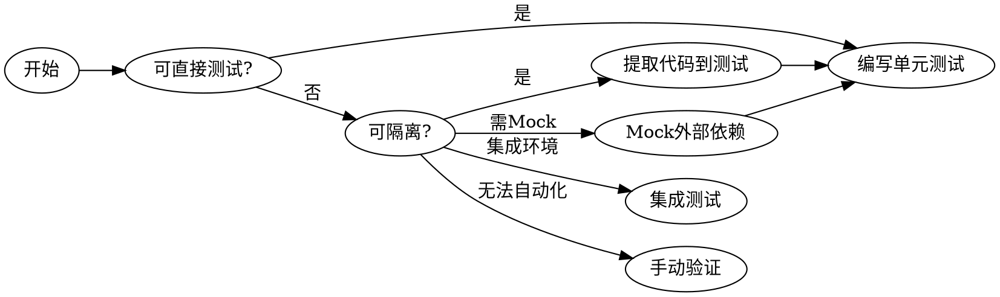

# 局部代码修改技能（code-part-modification）

## 核心原则

- **最小化修改**：只修改完成目标功能所需的最小代码范围，避免"顺手优化"
- **无蝴蝶效应**：确保修改不影响其他功能，不引入隐性依赖，不破坏现有契约

## 适用场景

| 场景 | 说明 |
| ------ | ------ |
| Bug修复 | 修复特定缺陷，确保不影响其他功能 |
| 功能增加 | 添加新功能，最小化对现有代码的影响 |
| 功能修改 | 修改现有功能，保持向后兼容 |
| 功能封闭 | 废弃或关闭功能，清理相关代码 |

## 执行流程



---

## Phase 1: 需求理解与修改点定位

### 1.1 需求理解

明确修改目标：

- **Bug修复**：复现路径、错误信息、期望行为
- **功能增加**：新功能描述、输入输出、边界条件
- **功能修改**：修改前行为、修改后行为、兼容性要求
- **功能封闭**：关闭范围、保留功能、清理范围

输出：`templates/requirement.md`

### 1.2 定位修改点

| 方法 | 工具 | 适用场景 |
| ------ | ------ | ---------- |
| 关键字搜索 | grep/rg | 根据错误信息定位 |
| 调用链追踪 | IDE/代码分析 | 理解数据流 |
| 日志追踪 | 日志文件 | 定位运行时位置 |
| 堆栈分析 | 异常堆栈 | Bug修复定位 |

输出：修改点清单（文件、行号、修改类型、说明）

### 1.3 影响范围分析

| 检查维度 | 检查项 | 方法 |
| ---------- | -------- | ------ |
| 内部调用 | 谁调用了这个方法/函数？ | grep 调用点 |
| 上游系统 | 哪些外部系统调用此接口？ | 接口文档、日志 |
| 下游系统 | 此代码调用了哪些外部系统？ | 代码分析 |
| 数据库 | 涉及哪些表、字段？ | SQL 分析 |
| UI界面 | 界面显示哪些字段？ | 前端代码分析 |
| 配置 | 依赖哪些配置项？ | 配置文件分析 |

输出：`templates/impact-analysis.md`

---

## Phase 2: 任务分解

将修改任务分解到**可独立验证**的粒度：

| 粒度   | 标准                 | 示例                         |
|--------|----------------------|------------------------------|
| 太大   | 无法独立验证         | "重构订单模块"               |
| 合适   | 有明确的验证器       | "修改订单状态字段校验逻辑"   |
| 太小   | 验证成本高于修改成本 | "修改变量名"                 |

输出：`templates/tasks.md`

---

## Phase 3: 测试策略

### 3.1 测试环境判断



### 3.2 代码提取策略

| 策略     | 适用场景               | 方法                           |
|----------|------------------------|--------------------------------|
| 提取方法 | 逻辑可独立但嵌入大方法 | 将目标逻辑提取为独立方法       |
| 提取类   | 依赖复杂无法直接测试   | 提取纯逻辑类，无外部依赖       |
| 复制修改 | 无法隔离的代码         | 复制一份修改，原代码保持不变   |

输出：`templates/test-cases.md`

---

## Phase 4: 最小化修改实现

| 原则 | 说明 | 反例 |
| ------ | ------ | ------ |
| 单一职责 | 每次修改只做一件事 | 同时修Bug和重构 |
| 最小范围 | 只修改必要的代码 | "顺手"修改其他代码 |
| 保持兼容 | 不破坏现有接口 | 修改返回值结构 |
| 可回滚 | 修改可独立回滚 | 多功能耦合修改 |

输出：`templates/changes.md`

---

## Phase 5: 自愈循环验证

### 5.1 验证器

| 验证类型 | 验证器 | 命令 |
| ---------- | -------- | ------ |
| 单元测试 | JUnit/pytest/go test | `mvn test -Dtest=XxxTest` |
| 代码规范 | lint/checkstyle | `mvn checkstyle:check` |
| 类型检查 | TypeScript/mypy | `tsc --noEmit` |
| 静态分析 | SonarQube/spotbugs | `mvn spotbugs:check` |
| 集成测试 | 测试套件 | `mvn verify` |

### 5.2 自愈循环规则

| 循环次数 | 处理策略 |
| ---------- | ---------- |
| 1-3次 | 自动修复，继续循环 |
| 4-5次 | 重新评估方案，可能需要人工介入 |
| >5次 | 停止，记录问题，请求人工帮助 |

输出：`templates/verification.log.md`

---

## Phase 6: 全量关联检查

### 6.1 关联影响矩阵

| 修改点 | UI | 数据库 | 上游系统 | 下游系统 | 内部模块 |
| -------- | ---- | ---- | ---------- | ---------- | ---------- |
| 参数校验 | ✗ | ✗ | ✗ | ✗ | 需检查 |
| 返回值 | 需检查 | ✗ | ✗ | 需检查 | 需检查 |
| 数据库字段 | ✗ | 需检查 | ✗ | ✗ | 需检查 |
| 接口契约 | 需检查 | ✗ | 需通知 | 需通知 | 需检查 |

### 6.2 蝴蝶效应检查方法

1. **静态分析**：IDE"查找用法"
2. **调用链追踪**：追踪方法调用链
3. **字段追踪**：追踪字段所有读写点
4. **接口追踪**：追踪接口所有调用点

输出：`templates/association-checklist.md`、`templates/butterfly-check.md`

---

## Phase 7: 输出文档

输出：`templates/report.md`

### 文件结构

```text
docs/code-part-modification/
└── task-{yyyymmdd}-{seq}/
    ├── requirement.md
    ├── impact-analysis.md
    ├── tasks.md
    ├── test-cases.md
    ├── changes.md
    ├── verification.log
    ├── butterfly-check.md
    └── report.md
```

---

## 最佳实践

| 主题 | 要点 |
| ------ | ------ |
| 修改粒度 | 单Bug=1修改点；功能增强=1功能点；重构=1类/模块 |
| 测试优先级 | 必须：修改点单元测试+直接调用方集成；建议：影响范围回归；可选：全量回归 |
| 回滚策略 | 每次修改可独立回滚，记录回滚命令和影响 |
| 文档同步 | API文档、README、CHANGELOG、内部文档 |

---

## 与其他技能集成

| 技能 | 用途 |
| ------ | ------ |
| `code-review` | 修改完成后审查代码 |
| `code-detect-dup` | 检查是否引入重复代码 |
| `java-gen-unittest` | 自动生成单元测试 |

---

## 常见问题

| 问题 | 方案 |
| ------ | ------ |
| 修改点无法测试 | 提取方法/类 → Mock隔离 → 复制到测试环境 → 集成测试 |
| 如何确保不影响其他功能 | 全量关联检查 → 回归测试 → 检查调用点 → 验证接口兼容性 |
| 多个修改点如何处理 | 识别依赖 → 按序逐一修改 → 独立验证 → 集成验证 |
| 验证一直失败 | 记录次数(>5停止) → 重新评估方案 → 人工介入 → 替代方案 |

---

## 检查清单

**开始前**：需求已明确 / 修改点已定位 / 影响范围已分析

**修改中**：修改遵循最小化原则 / 测试已覆盖修改点 / 自愈循环验证通过

**完成后**：全量关联检查完成 / 蝴蝶效应检查通过 / 文档已更新 / 任务报告已输出
