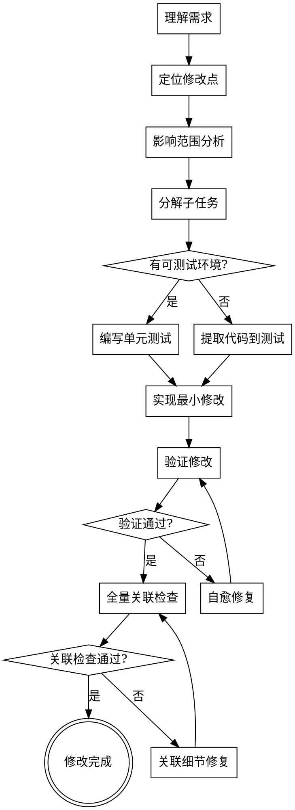
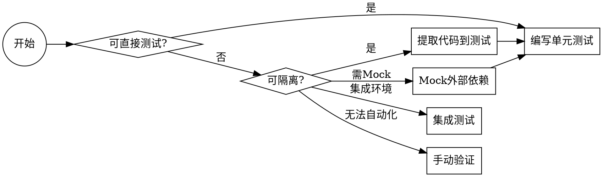
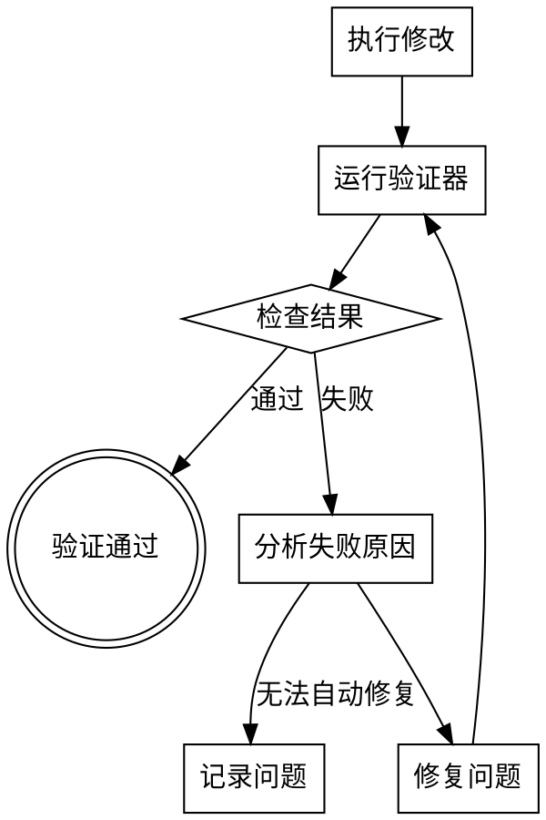

# 局部代码修改技能（code-part）

## 核心原则

### 原则一：最小化修改

只修改完成目标功能所需的最小代码范围，避免"顺手优化"或"顺便重构"。

### 原则二：无蝴蝶效应

确保修改不影响其他功能，不引入隐性依赖，不破坏现有契约。

## 概述

基于"组装线"模式的局部代码修改方法论，将复杂修改任务分解为可独立验证的小步骤，通过自愈循环确保每个步骤正确完成。

**核心理念**：

- 问题分解到可独立验证的粒度
- 每个修改点都有明确的验证器
- 自愈循环：修改 → 验证 → 修复 → 再验证
- 全量关联检查确保无遗漏

## 适用场景

| 场景 | 说明 |
| ------ | ------ |
| **Bug修复** | 修复特定缺陷，确保不影响其他功能 |
| **功能增加** | 添加新功能，最小化对现有代码的影响 |
| **功能修改** | 修改现有功能，保持向后兼容 |
| **功能封闭** | 废弃或关闭功能，清理相关代码 |

## 执行流程



---

## Phase 1: 需求理解与修改点定位

### 1.1 需求理解

明确修改目标：

- **Bug修复**：复现路径、错误信息、期望行为
- **功能增加**：新功能描述、输入输出、边界条件
- **功能修改**：修改前行为、修改后行为、兼容性要求
- **功能封闭**：关闭范围、保留功能、清理范围

**输出**：`docs/code-part/task-{yyyymmdd}-{seq}/requirement.md`

```markdown
# 需求说明

## 任务类型
[ ] Bug修复  [ ] 功能增加  [ ] 功能修改  [ ] 功能封闭

## 需求描述
[详细描述需求]

## 验收标准
1. [标准1]
2. [标准2]

## 约束条件
- [约束1]
- [约束2]
```

### 1.2 定位修改点

使用以下方法定位需要修改的代码：

| 方法 | 工具 | 适用场景 |
| ------ | ------ | ---------- |
| 关键字搜索 | grep/rg | 根据错误信息定位 |
| 调用链追踪 | IDE/代码分析 | 理解数据流 |
| 日志追踪 | 日志文件 | 定位运行时位置 |
| 堆栈分析 | 异常堆栈 | Bug修复定位 |

**输出**：修改点清单

```markdown
## 修改点清单

| 序号 | 文件 | 行号 | 修改类型 | 说明 |
|------|------|------|----------|------|
| 1 | src/main/java/.../Service.java | 45-52 | 修改 | 修复空指针 |
| 2 | src/main/java/.../Controller.java | 23 | 新增 | 添加参数校验 |
```

### 1.3 影响范围分析

**核心检查清单**：

| 检查维度 | 检查项 | 方法 |
| ---------- | -------- | ------ |
| **内部调用** | 谁调用了这个方法/函数？ | grep 调用点 |
| **上游系统** | 哪些外部系统调用此接口？ | 接口文档、日志 |
| **下游系统** | 此代码调用了哪些外部系统？ | 代码分析 |
| **数据库** | 涉及哪些表、字段？ | SQL 分析 |
| **UI界面** | 界面显示哪些字段？ | 前端代码分析 |
| **配置** | 依赖哪些配置项？ | 配置文件分析 |

**输出**：`docs/code-part/task-{yyyymmdd}-{seq}/impact-analysis.md`

```markdown
# 影响范围分析

## 直接影响
| 影响范围 | 文件/位置 | 影响程度 |
|----------|-----------|----------|
| 方法A | Service.java:45 | 直接修改 |

## 间接影响
| 影响范围 | 文件/位置 | 影响说明 |
|----------|-----------|----------|
| 调用点B | Controller.java:23 | 需确认参数兼容 |

## 上游系统
| 系统 | 接口 | 影响 |
|------|------|------|
| 订单系统 | /api/order | 需确认字段兼容 |

## 下游系统
| 系统 | 接口 | 影响 |
|------|------|------|
| 库存系统 | /api/inventory | 无影响 |

## 数据库
| 表 | 字段 | 操作 |
|------|------|------|
| t_order | status | 查询 |

## UI界面
| 页面 | 字段 | 影响 |
|------|------|------|
| 订单详情页 | 订单状态 | 需更新显示逻辑 |
```

---

## Phase 2: 任务分解

### 2.1 分解原则

将修改任务分解到**可独立验证**的粒度：

| 粒度 | 标准 | 示例 |
|------|------|------|
| 太大 | 无法独立验证 | "重构订单模块" |
| 合适 | 有明确的验证器 | "修改订单状态字段校验逻辑" |
| 太小 | 验证成本高于修改成本 | "修改变量名" |

### 2.2 任务清单模板

**输出**：`docs/code-part/task-{yyyymmdd}-{seq}/tasks.md`

```markdown
# 任务清单

## 任务状态
- [ ] 任务1：修改参数校验
- [ ] 任务2：更新数据库查询
- [ ] 任务3：修改返回值处理
- [ ] 任务4：更新前端显示

## 任务详情

### 任务1：修改参数校验
- **目标**：添加参数非空校验
- **修改文件**：Service.java:45-52
- **验证方法**：单元测试 testValidateParam()
- **关联影响**：无
```

---

## Phase 3: 测试策略

### 3.1 测试环境判断



### 3.2 代码提取策略

当修改点无法直接测试时，采用以下策略：

#### 策略A：提取方法

```java
// 原代码（难以测试）
public void process(Order order) {
    // 大量逻辑
    if (order.getStatus() == null) {
        throw new IllegalArgumentException("状态不能为空");
    }
    // 更多逻辑...
}

// 提取后（可独立测试）
public void validateOrderStatus(Order order) {
    if (order.getStatus() == null) {
        throw new IllegalArgumentException("状态不能为空");
    }
}

// 测试代码
@Test
public void testValidateOrderStatus() {
    Order order = new Order();
    order.setStatus(null);
    assertThrows(IllegalArgumentException.class, 
        () -> service.validateOrderStatus(order));
}
```

#### 策略B：提取类

```java
// 原代码（依赖复杂）
public class OrderService {
    public void process(Order order) {
        // 依赖数据库、网络、文件系统...
    }
}

// 提取纯逻辑类
public class OrderValidator {
    public ValidationResult validate(Order order) {
        // 纯逻辑，无依赖，可测试
    }
}

// 测试代码
@Test
public void testOrderValidation() {
    OrderValidator validator = new OrderValidator();
    Order order = createTestOrder();
    ValidationResult result = validator.validate(order);
    assertTrue(result.isValid());
}
```

#### 策略C：复制修改

```java
// 对于无法隔离的代码，复制一份进行修改
// 原代码保持不变，新代码单独测试

// 原方法保持不变
public void oldProcess(Order order) { ... }

// 新方法独立测试
public void newProcess(Order order) {
    // 新逻辑
}

// 测试新方法
@Test
public void testNewProcess() {
    service.newProcess(testOrder);
    // 验证
}
```

### 3.3 测试用例模板

**输出**：`docs/code-part/task-{yyyymmdd}-{seq}/test-cases.md`

```markdown
# 测试用例

## 单元测试
| 用例ID | 测试方法 | 输入 | 期望输出 | 状态 |
|--------|----------|------|----------|------|
| UT001 | testValidateOrderStatus | status=null | 抛出异常 | [ ] |
| UT002 | testValidateOrderStatus | status=VALID | 正常返回 | [ ] |

## 集成测试
| 用例ID | 测试场景 | 验证点 | 状态 |
|--------|----------|--------|------|
| IT001 | 订单流程 | 状态流转正确 | [ ] |

## 回归测试
| 用例ID | 测试范围 | 验证点 | 状态 |
|--------|----------|--------|------|
| RT001 | 相关功能 | 功能正常 | [ ] |
```

---

## Phase 4: 最小化修改实现

### 4.1 修改原则

| 原则 | 说明 | 反例 |
| ------ | ------ | ------ |
| **单一职责** | 每次修改只做一件事 | 同时修Bug和重构 |
| **最小范围** | 只修改必要的代码 | "顺手"修改其他代码 |
| **保持兼容** | 不破坏现有接口 | 修改返回值结构 |
| **可回滚** | 修改可独立回滚 | 多功能耦合修改 |

### 4.2 修改记录模板

**输出**：`docs/code-part/task-{yyyymmdd}-{seq}/changes.md`

```markdown
# 修改记录

## 修改1：参数校验增强
- **文件**：src/main/java/.../OrderService.java
- **行号**：45-52
- **修改前**：
  ```java
  public void process(Order order) {
      // 无校验
  }
  ```

- **修改后**：

  ```java
  public void process(Order order) {
      if (order == null || order.getStatus() == null) {
          throw new IllegalArgumentException("订单或状态不能为空");
      }
  }
  ```

- **修改原因**：修复空指针异常
- **影响范围**：仅影响调用方异常处理

## 修改验证

- [ ] 单元测试通过
- [ ] 代码审查通过
- [ ] 无副作用验证通过

```

---

## Phase 5: 自愈循环验证

### 5.1 验证循环



### 5.2 验证器设计

**验证器清单**：

| 验证类型 | 验证器 | 命令 |
| ---------- | -------- | ------ |
| 单元测试 | JUnit/pytest/go test | `mvn test -Dtest=XxxTest` |
| 代码规范 | lint/checkstyle | `mvn checkstyle:check` |
| 类型检查 | TypeScript/mypy | `tsc --noEmit` |
| 静态分析 | SonarQube/spotbugs | `mvn spotbugs:check` |
| 集成测试 | 测试套件 | `mvn verify` |

### 5.3 自愈循环规则

| 循环次数 | 处理策略 |
| ---------- | ---------- |
| 1-3次 | 自动修复，继续循环 |
| 4-5次 | 重新评估方案，可能需要人工介入 |
| >5次 | 停止，记录问题，请求人工帮助 |

**输出**：`docs/code-part/task-{yyyymmdd}-{seq}/verification.log`

```markdown
# 验证日志

## 第1次验证
- **时间**：2024-01-01 10:00:00
- **验证器**：单元测试
- **结果**：失败
- **失败原因**：testValidateOrderStatus 断言失败
- **修复措施**：修正校验逻辑

## 第2次验证
- **时间**：2024-01-01 10:05:00
- **验证器**：单元测试
- **结果**：通过

## 第3次验证
- **时间**：2024-01-01 10:06:00
- **验证器**：静态分析
- **结果**：通过

## 最终结果
- **总循环次数**：2
- **状态**：验证通过
```

---

## Phase 6: 全量关联检查

### 6.1 关联检查清单

修改完成后，执行全量关联检查：

```markdown
# 全量关联检查清单

## 内部关联
- [ ] 直接调用方已验证
- [ ] 间接调用方已确认无影响
- [ ] 相关类/方法已检查
- [ ] 配置文件已检查

## 上游系统关联
- [ ] 接口契约未变更（或已通知）
- [ ] 接口字段未删除（或已协商）
- [ ] 接口返回值兼容
- [ ] 上游系统已通知

## 下游系统关联
- [ ] 下游调用未变更（或已适配）
- [ ] 下游接口契约兼容
- [ ] 异常处理已确认

## 数据库关联
- [ ] SQL语句已检查
- [ ] 字段变更已评估
- [ ] 索引影响已评估
- [ ] 数据迁移已规划

## UI界面关联
- [ ] 显示字段已确认
- [ ] 输入字段已确认
- [ ] 错误提示已确认
- [ ] 国际化已处理

## 其他关联
- [ ] 日志输出已确认
- [ ] 监控指标已确认
- [ ] 文档已更新
- [ ] 版本号已更新
```

### 6.2 关联影响矩阵

| 修改点 | UI | 数据库 | 上游系统 | 下游系统 | 内部模块 |
| -------- | ---- | ---- | ---------- | ---------- | ---------- |
| 参数校验 | ✗ | ✗ | ✗ | ✗ | 需检查 |
| 返回值 | 需检查 | ✗ | ✗ | 需检查 | 需检查 |
| 数据库字段 | ✗ | 需检查 | ✗ | ✗ | 需检查 |
| 接口契约 | 需检查 | ✗ | 需通知 | 需通知 | 需检查 |

### 6.3 蝴蝶效应检查

**检查方法**：

1. **静态分析**：使用 IDE 的"查找用法"功能
2. **调用链追踪**：追踪方法调用链
3. **字段追踪**：追踪字段的所有读写点
4. **接口追踪**：追踪接口的所有调用点

**输出**：`docs/code-part/task-{yyyymmdd}-{seq}/butterfly-check.md`

```markdown
# 蝴蝶效应检查报告

## 修改点：OrderService.process()

### 调用链追踪
```

Controller.order()
  └── OrderService.process()  [修改点]
       └── OrderRepository.save()
            └── Database

```

### 字段影响追踪
| 字段 | 读点 | 写点 | 本次修改影响 |
|------|------|------|--------------|
| status | Service.java:46 | Controller.java:23 | 新增校验，不影响写入 |

### 接口影响追踪
| 接口 | 调用方 | 影响 |
|------|--------|------|
| POST /api/order | 前端订单页 | 需更新错误处理 |

### 结论
- [ ] 无蝴蝶效应
- [x] 有轻微影响，已处理
- [ ] 有严重影响，需评估
```

---

## Phase 7: 输出文档

### 7.1 任务完成报告

**输出**：`docs/code-part/task-{yyyymmdd}-{seq}/report.md`

```markdown
# 代码修改完成报告

## 任务概述
- **任务类型**：Bug修复
- **任务描述**：修复订单处理空指针异常
- **完成时间**：2024-01-01

## 修改汇总
| 文件 | 修改行数 | 修改类型 |
|------|----------|----------|
| OrderService.java | 8行 | 新增校验 |
| OrderServiceTest.java | 30行 | 新增测试 |

## 测试覆盖
- **单元测试**：3个用例，全部通过
- **集成测试**：1个用例，全部通过
- **回归测试**：相关功能正常

## 关联检查
- [x] 内部关联检查通过
- [x] 上游系统确认无影响
- [x] 下游系统确认无影响
- [x] 数据库无影响
- [x] UI界面需更新错误提示（已通知前端）

## 风险评估
- **风险等级**：低
- **回滚方案**：删除新增校验代码
- **监控建议**：关注订单处理异常日志

## 后续事项
- [ ] 更新API文档
- [ ] 通知前端更新错误处理
```

### 7.2 文件结构

```
docs/code-part/
└── task-{yyyymmdd}-{seq}/
    ├── requirement.md      # 需求说明
    ├── impact-analysis.md  # 影响范围分析
    ├── tasks.md            # 任务清单
    ├── test-cases.md       # 测试用例
    ├── changes.md          # 修改记录
    ├── verification.log    # 验证日志
    ├── butterfly-check.md  # 蝴蝶效应检查
    └── report.md           # 完成报告
```

---

## 最佳实践

### 1. 修改粒度控制

| 场景 | 建议粒度 | 说明 |
| ------ | ---------- | ------ |
| 单个Bug | 1个修改点 | 只修复问题本身 |
| 功能增强 | 1个功能点 | 完整功能，独立测试 |
| 重构优化 | 1个类/模块 | 完整单元，可独立验证 |

### 2. 测试优先级

1. **必须**：修改点的单元测试
2. **必须**：直接调用方的集成测试
3. **建议**：影响范围内的回归测试
4. **可选**：全量回归测试

### 3. 回滚策略

每次修改都应可独立回滚：

```markdown
## 回滚清单
| 文件 | 回滚命令 | 回滚影响 |
|------|----------|----------|
| OrderService.java | git checkout HEAD~1 -- OrderService.java | 恢复原始校验 |
| OrderServiceTest.java | rm OrderServiceTest.java | 删除新增测试 |
```

### 4. 文档同步

修改完成后同步更新：

- API文档（接口变更）
- README（配置变更）
- CHANGELOG（版本记录）
- 内部文档（架构变更）

---

## 与其他技能集成

### 与 `code-review` 集成

```bash
# 修改完成后进行代码审查
/code-part    # 完成修改
/code-review  # 审查修改代码
```

### 与 `code-detect-dup` 集成

```bash
# 检查是否引入重复代码
/code-part        # 完成修改
/code-detect-dup  # 检查重复代码
```

### 与 `java-gen-unittest` 集成

```bash
# 自动生成单元测试
/code-part           # 定位修改点
/java-gen-unittest   # 生成测试代码
```

---

## 常见问题处理

### Q1: 修改点无法测试怎么办？

**方案**：

1. 提取方法/类，使逻辑可测试
2. 使用Mock隔离外部依赖
3. 复制代码到测试环境修改
4. 使用集成测试环境

### Q2: 如何确保不影响其他功能？

**方案**：

1. 执行全量关联检查
2. 运行回归测试
3. 检查所有调用点
4. 验证上下游接口兼容性

### Q3: 多个修改点如何处理？

**方案**：

1. 识别修改点依赖关系
2. 按依赖顺序逐一修改
3. 每个修改点独立验证
4. 最后进行集成验证

### Q4: 验证一直失败怎么办？

**方案**：

1. 记录失败次数（>5次停止）
2. 重新评估修改方案
3. 寻求人工介入
4. 考虑替代方案

---

## 检查清单

**开始前**：

- [ ] 需求已明确
- [ ] 修改点已定位
- [ ] 影响范围已分析

**修改中**：

- [ ] 修改遵循最小化原则
- [ ] 测试已覆盖修改点
- [ ] 自愈循环验证通过

**完成后**：

- [ ] 全量关联检查完成
- [ ] 蝴蝶效应检查通过
- [ ] 文档已更新
- [ ] 任务报告已输出

---

## 参考资料

- ServiceTitan 大规模代码迁移实践（InfoQ）
- 《重构：改善既有代码的设计》- Martin Fowler
- 《代码整洁之道》- Robert C. Martin
