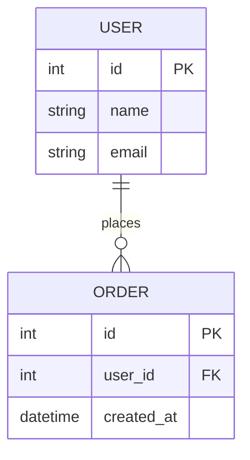

# 代码审查

<HARD-GATE>
理性，客观，实际，真实，不恭维，实事求是
</HARD-GATE>

## 概述

通过代码审查，找出代码中做得好的部分，找出做得不到位的部分。

## 语言支持

### 直接源码文件

| 语言 | 文件类型 | 规范文件 |
|------|----------|----------|
| Java | `*.java` | `spec.java.md` |
| Python | `*.py` | `spec.python.md` |
| C++ | `*.cpp *.hpp *.cxx *.hxx *.c *.h` | `spec.cpp.md` |
| Rust | `*.rs` | `spec.rust.md` |
| ANSI C | `*.c *.h` | `spec.ansi_c.md` |
| JavaScript | `*.js *.mjs *.cjs` | `spec.js.md` |
| TypeScript | `*.ts *.tsx *.mts *.cts` | `spec.js.md` |
| Go | `*.go` | - |
| Kotlin | `*.kt *.kts` | - |
| Scala | `*.scala *.sc` | - |
| Shell | `*.sh *.bash *.zsh` | - |
| Batch | `*.bat *.cmd *.ps1` | - |

### SQL 来源（需拼接提取）

| 来源类型 | 文件/位置 | 审查要点 |
|----------|-----------|----------|
| SQL文件 | `*.sql` | SQL注入、性能、索引 |
| MyBatis Mapper | `**/*Mapper.xml` | `$`符号拼接风险、参数绑定 |
| iBATIS SqlMap | `**/*SqlMap.xml` | SQL拼接风险 |
| Hibernate HQL | `*.java @NamedQuery` | HQL注入风险 |
| JPA SQL | `*.java @Query` | 参数绑定检查 |
| Java字符串SQL | `*.java` 字符串常量 | 字符串拼接注入风险 |
| Python SQL | `*.py` 字符串 | 字符串格式化注入风险 |
| 内嵌SQL | 各种源码 | 正则匹配审查 |

## 审查模式

### 全量审查（默认）

遍历项目所有源代码文件，进行全面审查。

### 增量审查

根据输入的 git 区间或 svn 区间，获取 diff patch 进行审查。

```bash
# Git 区间示例
git diff main..feature-branch

# SVN 区间示例
svn diff -r 100:200
```

## 编码规范

根据项目使用的编程语言，读取对应的编码规范：

```
授权读取：/disk2/helly_data/code/markdown/self-ai-spec/lang-spec/spec.{lang}.md

Read /disk2/helly_data/code/markdown/self-ai-spec/lang-spec/spec.{lang}.md
```

## 审查流程

### 1. 代码遍历与理解

- 遍历所有源代码文件，确保对代码之间联系有清晰认识
- 理解项目目的、意图、结构

### 2. 设计模式审查

- 对设计进行梳理，对使用的设计模式进行整理
- 对使用合理的进行指出表扬
- 对使用过度或不合理的进行指出批评

### 3. 代码结构审查

| 检查项 | 说明 |
|--------|------|
| 重复代码 | 可被复用/可被抽象的重复代码 |
| 方法长度 | 过长、扇入/扇出过多的方法 |
| 条件分支 | if 分发应优先考虑使用多态，次选 switch |
| 条件抽取 | if 过大应予以抽取，形成独立方法 |
| 静态分支 | if 判断如果在启动时就能确定的，应予以使用多态 |
| 缩进深度 | 最大不超过 4 层 |

### 4. 性能审查

| 检查项 | 说明 |
|--------|------|
| 高消耗方法 | Calendar.getInstance()/BigDecimal/未预编译的Pattern/String.split/replace/toJson/反射等 |
| 缓存问题 | 反复调用可缓存变量问题 |
| 对象创建 | 循环中创建对象、不必要的对象实例化 |
| 资源泄漏 | 流、连接、文件句柄未正确关闭 |

### 5. 并发审查

| 检查项 | 说明 |
|--------|------|
| 线程命名 | 线程创建必须命名 |
| 线程关闭 | 线程组必须存在关闭入口，且被调用 |
| 异常处理 | 长时间运行的线程，必须考虑到因异常导致线程异常退出的情况 |
| 状态管理 | 线程中使用的类，不得轻易修改成员变量，防止内存覆盖导致逻辑错误 |
| ThreadLocal | 需要考虑到内存泄漏问题 |
| 同步锁 | Lock 轻量锁，需要观察评估合理性 |
| 线程安全类 | SimpleDateFormat、DecimalFormat 等禁止声明为全局静态变量 |

### 6. 安全审查

| 检查项 | 说明 |
|--------|------|
| SQL 注入 | 检查 SQL 拼接、iBatis/MyBatis 中 `$` 符号使用 |
| XSS | 用户输入是否转义处理 |
| 敏感信息 | 密码、密钥是否硬编码 |
| 权限控制 | 接口是否有权限校验 |

### 7. 数据库审查

#### SQL 文件扫描

- 扫描 iBATIS/MyBatis 的 `*Map.xml` / `*Mapper.xml` 文件
- 扫描内嵌 SQL 语句
- 检查 SQL 注入风险（`$` 符号拼接）

#### 数据库清单构建

生成数据库详细清单，包含：

| 信息 | 说明 |
|------|------|
| 表名 | 数据库表名称 |
| 字段列表 | 字段名、类型、是否可空、默认值 |
| 主键 | 主键字段及类型 |
| 索引 | 索引名称、字段、类型（唯一/普通） |
| 外键 | 外键关联关系 |

#### ER 图生成

生成 ER 图，双格式输出：

- **Markdown+Mermaid 格式**：写入 `docs/review/code-review-{yyyymmdd}-{seq%000}-er-diagram.md`
- **PlantUML 格式**：写入 `docs/review/code-review-{yyyymmdd}-{seq%000}-er-diagram.puml`

其中 `{seq%000}` 保持和主文件相同，保证文件顺序。并将文件连接进主文件。



#### 数据库设计审查要点

| 审查项 | 关注点 |
|--------|--------|
| 索引设计 | 索引是否有辨识度、是否存在冗余索引、索引列顺序是否合理 |
| 连表设计 | 是否会导致大量连表、连表字段是否有索引 |
| 数据冗余 | 是否适度冗余、过度冗余或冗余不足 |
| 字段类型 | 类型选择是否合理（如金额用 DECIMAL 而非 FLOAT） |
| 分表策略 | 大表是否需要分表、分表键选择是否合理 |
| 事务边界 | 事务范围是否过大、是否存在长事务 |
| 锁粒度 | 行锁/表锁选择是否合理 |

#### 数据库设计思路摘要

输出数据库设计思路摘要，包含：

1. **业务模型分析**：核心业务实体及关系
2. **数据流向分析**：数据如何流转、如何落库
3. **典型数据类型选择**：
   - 主键策略（自增/UUID/雪花算法）
   - 金额类型（DECIMAL 精度）
   - 时间类型（DATETIME/TIMESTAMP）
   - 状态字段（ENUM/INT/TINYINT）
   - 大文本（TEXT/BLOB 分离策略）

4. **性能考量**：
   - 索引策略
   - 分页查询优化
   - 缓存策略

### 9. 坏味道分类扩展（基于 AI 时代新发现）

文章《代码在发臭：一个能"闻"出坏味道的 AI 技能》将坏味道扩展为 8 大类 50+ 种，特别针对 AI 生成代码的常见问题：

#### 架构类坏味道
| 坏味道 | 检测方法 | 重构建议 |
|--------|----------|----------|
| **大泥球** | 模块职责不清、边界模糊 | 重新划分模块边界 |
| **分布式单体** | 微服务拆分过细、频繁跨服务调用 | 合并相关服务 |
| **贫血模型** | 仅有 getter/setter 的数据对象 | 引入领域行为 |
| **CQRS 滥用** | 查询与命令分离过度复杂 | 简化设计 |
| **层边界违反** | 上层直接依赖底层实现细节 | 引入接口抽象 |
| **过度分层** | 不必要的中间层、层层转发 | 合并或移除冗余层 |
| **过度抽象** | 过早抽象、抽象层次过多 | 延迟抽象时机 |
| **"未来主义"架构** | 为不存在的需求过度设计 | 遵循 YAGNI 原则 |

#### 耦合类坏味道
| 坏味道 | 检测方法 | 重构建议 |
|--------|----------|----------|
| **循环依赖** | 模块间相互引用形成环 | 引入中间层或接口 |
| **内容耦合** | 模块直接修改对方内部状态 | 封装状态变更 |
| **公共耦合** | 过度使用全局状态 | 引入依赖注入 |
| **印记耦合** | 传递整个对象仅用部分字段 | 传递最小接口 |

#### 内聚类坏味道
| 坏味道 | 检测方法 | 重构建议 |
|--------|----------|----------|
| **上帝对象** | 单个类 > 500 行、方法 > 20 个 | Extract Class |
| **霰弹式修改** | 修改功能需改动多处代码 | Move Method |
| **依恋情结** | 方法过度访问其他类的数据 | Move Method |
| **数据泥团** | 总是一起出现的字段 | Introduce Parameter Object |
| **发散式变化** | 单个类因不同原因频繁修改 | Extract Class |

#### 设计类坏味道
| 坏味道 | 检测方法 | 重构建议 |
|--------|----------|----------|
| **抽象泄露** | 实现细节暴露给调用方 | 封装内部实现 |
| **静态粘连** | 过度使用 static 方法/字段 | 引入依赖注入 |
| **服务定位器滥用** | 依赖服务定位器而非注入 | 使用依赖注入 |
| **SOLID 违反** | 违反单一职责等原则 | 按原则重构 |
| **Switch 类型分支** | 基于类型的 switch/case 链 | Replace Conditional with Polymorphism |

#### 代码类坏味道（Fowler 经典）
| 坏味道 | 检测方法 | 重构建议 |
|--------|----------|----------|
| **重复代码** | 相同代码模式多处出现 | Extract Method |
| **长方法** | 方法 > 50 行 | Extract Method |
| **基本类型偏执** | 过度使用基本类型而非对象 | Replace Primitive with Object |
| **魔数魔串** | 代码中硬编码的数值/字符串 | Introduce Named Constant |
| **死代码** | 永远不会执行的代码 | 删除 |
| **深层嵌套** | 嵌套层次 > 4（箭头反模式） | Extract Method / Guard Clause |
| **过长参数列表** | 参数 > 5 个 | Introduce Parameter Object |

#### 测试类坏味道（AI 时代新增）
| 坏味道 | 检测方法 | 重构建议 |
|--------|----------|----------|
| **零测试覆盖** | AI 生成代码无测试 | 补充单元测试 |
| **测试-实现耦合** | 测试依赖具体实现细节 | 面向接口测试 |
| **不稳定测试** | 测试结果随机失败 | 隔离测试环境 |

#### 命名类坏味道
| 坏味道 | 检测方法 | 重构建议 |
|--------|----------|----------|
| **模糊命名** | Manager/Helper/Util 滥用 | 具体职责命名 |
| **命名不一致** | 相同概念不同命名 | 统一命名规范 |

#### 复杂度类坏味道（性能热点）
| 坏味道 | 检测方法 | 重构建议 |
|--------|----------|----------|
| **嵌套循环 O(n²)** | 循环内嵌套循环 | 优化算法复杂度 |
| **N+1 查询** | 循环内发起查询 | 批量查询 + 预加载 |
| **重复线性扫描** | 循环内使用线性查找 | 改用 Set/Map |
| **循环内排序** | 每次迭代都排序 | 提前排序 |
| **渲染重复计算** | UI 渲染中重复计算 | 缓存计算结果 |
| **数据结构选错** | 使用低效数据结构 | 选择合适的数据结构 |

### 10. AI 生成代码特有审查

随着 AI 辅助编程普及，需特别关注以下 AI 生成代码的常见问题：

| 审查要点 | 检测方法 | 建议处理 |
|----------|----------|----------|
| **零测试覆盖** | 检查新代码是否有配套测试 | 强制要求补充测试 |
| **过度复杂化** | AI 倾向于生成"聪明"但难懂的代码 | 要求简化实现 |
| **魔法字符串/数字** | 硬编码的业务逻辑值 | 提取为常量 |
| **缺少错误处理** | 乐观假设路径，缺少异常处理 | 补充边界检查和异常处理 |
| **性能陷阱** | 循环内查询、线性查找等 | 使用 `/lets-loop` 技能专门检测 |
| **安全漏洞** | 字符串拼接 SQL、未转义输出等 | 加强安全审查 |
| **硬编码配置** | API key、数据库连接等 | 提取到配置文件中 |
| **不符合团队规范** | 命名、格式与现有代码不一致 | 按团队规范修正 |
| **注释质量** | 生成无意义或错误的注释 | 审查并修正注释 |
| **过度抽象** | 为简单需求生成复杂抽象 | 简化设计 |

#### AI 代码审查建议
1. **必查项**：安全漏洞、零测试覆盖、性能陷阱
2. **建议项**：代码规范、错误处理、配置管理
3. **可忽略项**：个人风格差异（如大括号位置）

#### 与 `/lets-loop` 技能结合
对于 AI 生成的循环代码，建议同时运行：
```bash
# 常规代码审查
/code-review

# 专门的循环性能审查
/lets-loop
```

| 检查项 | 说明 |
|--------|------|
| 事务管理 | DAO 只能注入到 Service，不得在其他类型中使用 |
| 纯内存操作 | 不应该开启事务 |
| 序列化 | serialVersionUID 定义 |
| 异常处理 | 异常不能只打日志，需要后续处理 |

#### C/C++ 特有

| 检查项 | 说明 |
|--------|------|
| 内存管理 | new/delete、malloc/free 对称性 |
| 指针安全 | 空指针、悬垂指针 |
| 缓冲区溢出 | 数组越界、字符串操作 |

#### Rust 特有

| 检查项 | 说明 |
|--------|------|
| 所有权 | 生命周期标注是否合理 |
| 错误处理 | unwrap 使用是否安全 |
| unsafe | unsafe 块是否有必要 |

## 输出

### 输出文件

每次审查结果以中文输出到：

```
docs/review/code-review-{yyyymmdd}-{seq%000}.md
```

### 输出结构

```markdown
# 代码审查报告

## 项目概述
[项目简介、技术栈]

## 审查范围
[审查的文件范围、代码行数]

## 优秀设计
[值得表扬的设计模式、代码结构]

## 问题列表

### 严重问题
| 序号 | 文件 | 行号 | 问题描述 | 建议修改 |
|------|------|------|----------|----------|
| 1 | xxx.java | 100 | SQL注入风险 | 使用参数化查询 |

### 一般问题
| 序号 | 文件 | 行号 | 问题描述 | 建议修改 |
|------|------|------|----------|----------|

### 建议改进
| 序号 | 文件 | 行号 | 问题描述 | 建议修改 |
|------|------|------|----------|----------|

## 数据库设计
[数据库清单、ER图、设计思路摘要]

## 总结
[整体评价、改进建议]

---
Reviewed by {coding util}+{model name}
```

### 署名格式

输出文件末尾必须添加署名：

```
Reviewed by {coding util}+{model name}
```

例如：`Reviewed by opencode+GLM5`

## 核心原则

1. **谦逊**：目的是治病救人，目的不是羞辱人
2. **客观**：基于事实和规范，不带个人偏见
3. **建设性**：不仅指出问题，还要给出建议
4. **优先级**：严重问题优先，区分必须修正/应当修正/建议改进
