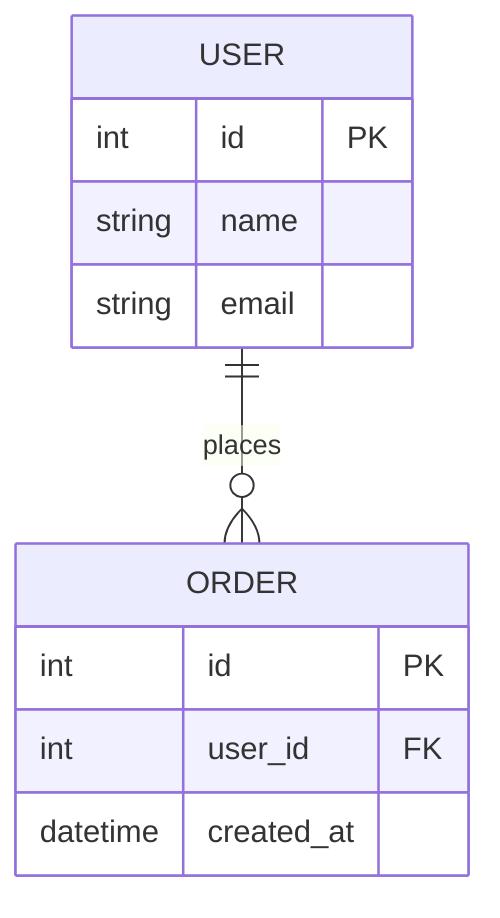

# 代码审查

**审查原则**：理性、客观、实际、真实、不恭维、实事求是

## 概述

通过代码审查，找出代码中做得好的部分，找出做得不到位的部分。

## 语言支持

### 直接源码文件

| 语言 | 文件类型 | 规范文件 |
| ------ | ---------- | ---------- |
| Java | `*.java` | `spec.java.md` |
| Python | `*.py` | `spec.python.md` |
| C++ | `*.cpp *.hpp *.cxx *.hxx *.c *.h` | `spec.cpp.md` |
| Rust | `*.rs` | `spec.rust.md` |
| ANSI C | `*.c *.h` | `spec.ansi_c.md` |
| JavaScript | `*.js *.mjs *.cjs` | `spec.js.md` |
| TypeScript | `*.ts *.tsx *.mts *.cts` | `spec.js.md` |
| Go | `*.go` | - |
| Kotlin | `*.kt *.kts` | - |
| Scala | `*.scala *.sc` | - |
| Shell | `*.sh *.bash *.zsh` | - |
| Batch | `*.bat *.cmd *.ps1` | - |

### SQL 来源（需拼接提取）

| 来源类型 | 文件/位置 | 审查要点 |
| ---------- | ----------- | ---------- |
| SQL文件 | `*.sql` | SQL注入、性能、索引 |
| MyBatis Mapper | `**/*Mapper.xml` | `$`符号拼接风险、参数绑定 |
| iBATIS SqlMap | `**/*SqlMap.xml` | SQL拼接风险 |
| Hibernate HQL | `*.java @NamedQuery` | HQL注入风险 |
| JPA SQL | `*.java @Query` | 参数绑定检查 |
| Java字符串SQL | `*.java` 字符串常量 | 字符串拼接注入风险 |
| Python SQL | `*.py` 字符串 | 字符串格式化注入风险 |
| 内嵌SQL | 各种源码 | 正则匹配审查 |

## 审查模式

### 全量审查（默认）

遍历项目所有源代码文件，进行全面审查。

### 增量审查

根据输入的 git 区间或 svn 区间，获取 diff patch 进行审查。

```bash
# Git 区间示例
git diff main..feature-branch

# SVN 区间示例
svn diff -r 100:200
```

## 编码规范

根据项目使用的编程语言，读取对应的编码规范：

```bash
授权读取：/disk2/helly_data/code/markdown/self-ai-spec/lang-spec/spec.{lang}.md

Read /disk2/helly_data/code/markdown/self-ai-spec/lang-spec/spec.{lang}.md
```

## 审查流程

### 1. 代码遍历与理解

- 遍历所有源代码文件，确保对代码之间联系有清晰认识
- 理解项目目的、意图、结构

### 2. 设计模式审查

- 对设计进行梳理，对使用的设计模式进行整理
- 对使用合理的进行指出表扬
- 对使用过度或不合理的进行指出批评

### 3. 代码结构审查

| 检查项 | 说明 |
| -------- | ------ |
| 重复代码 | 可被复用/可被抽象的重复代码 |
| 方法长度 | 过长、扇入/扇出过多的方法 |
| 条件分支 | if 分发应优先考虑使用多态，次选 switch |
| 条件抽取 | if 过大应予以抽取，形成独立方法 |
| 静态分支 | if 判断如果在启动时就能确定的，应予以使用多态 |
| 缩进深度 | 最大不超过 4 层 |

### 4. 性能审查

| 检查项 | 说明 |
| -------- | ------ |
| 高消耗方法 | Calendar.getInstance()/BigDecimal/未预编译的Pattern/ |
| | String.split/replace/toJson/反射等 |
| 缓存问题 | 反复调用可缓存变量问题 |
| 对象创建 | 循环中创建对象、不必要的对象实例化 |
| 资源泄漏 | 流、连接、文件句柄未正确关闭 |

### 5. 并发审查

| 检查项 | 说明 |
| -------- | ------ |
| 线程命名 | 线程创建必须命名 |
| 线程关闭 | 线程组必须存在关闭入口，且被调用 |
| 异常处理 | 长时间运行的线程，必须考虑到因异常导致线程异常退出的情况 |
| 状态管理 | 线程中使用的类，不得轻易修改成员变量，防止内存覆盖导致逻辑错误 |
| ThreadLocal | 需要考虑到内存泄漏问题 |
| 同步锁 | Lock 轻量锁，需要观察评估合理性 |
| 线程安全类 | SimpleDateFormat、DecimalFormat 等禁止声明为全局静态变量 |

### 6. 安全审查

**⚠️ 重要：敏感数据审查是所有代码审查的必须项，无论使用何种编程语言。包括Java、Python、JavaScript、C/C++、Rust等所有语言的代码都需要进行敏感数据审查。**

| 检查项 | 说明 |
| -------- | ------ |
| SQL 注入 | 检查 SQL 拼接、iBatis/MyBatis 中 `$` 符号使用 |
| XSS | 用户输入是否转义处理 |
| **敏感信息泄露** | **密码、密钥、令牌、API Key等是否硬编码、是否记录到日志/调试输出** |
| **敏感数据内存残留** | **敏感数据在内存中是否安全清除（memset/zero out）** |
| **敏感字段输出** | **禁止明文输出敏感信息到控制台、日志、错误消息** |
| **安全日志处理** | **日志中是否过滤敏感信息，使用安全日志宏** |
| 权限控制 | 接口是否有权限校验 |

**审查要点**：

1. 密码、密钥、API Key等是否硬编码在源代码中
2. 调试信息是否包含敏感数据（JSON响应、错误消息）
3. 日志文件是否记录敏感信息（用户名、密码、token）
4. 内存中的敏感数据是否被安全清除（尤其C/C++项目）
5. 是否使用安全的字符串处理函数（strncpy替代strcpy）

**重构建议**：

- 使用环境变量或密钥管理服务存储敏感配置
- 实现安全日志宏过滤敏感字段
- 敏感数据封装类（自动清除内存）
- 禁止硬编码任何形式的密钥、密码
- 实施代码审查规则禁止敏感信息泄露

### 7. 数据库审查

#### SQL 文件扫描

- 扫描 iBATIS/MyBatis 的 `*Map.xml` / `*Mapper.xml` 文件
- 扫描内嵌 SQL 语句
- 检查 SQL 注入风险（`$` 符号拼接）

#### 数据库清单构建

生成数据库详细清单，包含：

| 信息 | 说明 |
| ------ | ------ |
| 表名 | 数据库表名称 |
| 字段列表 | 字段名、类型、是否可空、默认值 |
| 主键 | 主键字段及类型 |
| 索引 | 索引名称、字段、类型（唯一/普通） |
| 外键 | 外键关联关系 |

#### ER 图生成

生成 ER 图，双格式输出：

- **Markdown+Mermaid 格式**：写入 `docs/review/code-review-{yyyymmdd}-{seq%000}-er-diagram.md`
- **PlantUML 格式**：写入 `docs/review/code-review-{yyyymmdd}-{seq%000}-er-diagram.puml`

其中 `{seq%000}` 保持和主文件相同，保证文件顺序。并将文件连接进主文件。



#### 数据库设计审查要点

| 审查项 | 关注点 |
| -------- | -------- |
| 索引设计 | 索引是否有辨识度、是否存在冗余索引、索引列顺序是否合理 |
| 连表设计 | 是否会导致大量连表、连表字段是否有索引 |
| 数据冗余 | 是否适度冗余、过度冗余或冗余不足 |
| 字段类型 | 类型选择是否合理（如金额用 DECIMAL 而非 FLOAT） |
| 分表策略 | 大表是否需要分表、分表键选择是否合理 |
| 事务边界 | 事务范围是否过大、是否存在长事务 |
| 锁粒度 | 行锁/表锁选择是否合理 |

#### 数据库设计思路摘要

输出数据库设计思路摘要，包含：

1. **业务模型分析**：核心业务实体及关系
2. **数据流向分析**：数据如何流转、如何落库
3. **典型数据类型选择**：
   - 主键策略（自增/UUID/雪花算法）
   - 金额类型（DECIMAL 精度）
   - 时间类型（DATETIME/TIMESTAMP）
   - 状态字段（ENUM/INT/TINYINT）
   - 大文本（TEXT/BLOB 分离策略）

4. **性能考量**：
   - 索引策略
   - 分页查询优化
   - 缓存策略

### 9. 坏味道分类扩展（基于 AI 时代新发现）

文章《代码在发臭：一个能"闻"出坏味道的 AI 技能》将坏味道扩展为 8 大类 50+ 种，特别针对 AI 生成代码的常见问题：

#### 架构类坏味道

| 坏味道 | 检测方法 | 重构建议 |
| -------- | ---------- | ---------- |
| **大泥球** | 模块职责不清、边界模糊 | 重新划分模块边界 |
| **分布式单体** | 微服务拆分过细、频繁跨服务调用 | 合并相关服务 |
| **贫血模型** | 仅有 getter/setter 的数据对象 | 引入领域行为 |
| **CQRS 滥用** | 查询与命令分离过度复杂 | 简化设计 |
| **层边界违反** | 上层直接依赖底层实现细节 | 引入接口抽象 |
| **过度分层** | 不必要的中间层、层层转发 | 合并或移除冗余层 |
| **过度抽象** | 过早抽象、抽象层次过多 | 延迟抽象时机 |
| **"未来主义"架构** | 为不存在的需求过度设计 | 遵循 YAGNI 原则 |

#### 耦合类坏味道

| 坏味道 | 检测方法 | 重构建议 |
| -------- | ---------- | ---------- |
| **循环依赖** | 模块间相互引用形成环 | 引入中间层或接口 |
| **内容耦合** | 模块直接修改对方内部状态 | 封装状态变更 |
| **公共耦合** | 过度使用全局状态 | 引入依赖注入 |
| **印记耦合** | 传递整个对象仅用部分字段 | 传递最小接口 |

#### 内聚类坏味道

| 坏味道 | 检测方法 | 重构建议 |
| -------- | ---------- | ---------- |
| **上帝对象** | 单个类 > 500 行、方法 > 20 个 | Extract Class |
| **霰弹式修改** | 修改功能需改动多处代码 | Move Method |
| **依恋情结** | 方法过度访问其他类的数据 | Move Method |
| **数据泥团** | 总是一起出现的字段 | Introduce Parameter Object |
| **发散式变化** | 单个类因不同原因频繁修改 | Extract Class |

#### 设计类坏味道

| 坏味道 | 检测方法 | 重构建议 |
| -------- | ---------- | ---------- |
| **抽象泄露** | 实现细节暴露给调用方 | 封装内部实现 |
| **静态粘连** | 过度使用 static 方法/字段 | 引入依赖注入 |
| **服务定位器滥用** | 依赖服务定位器而非注入 | 使用依赖注入 |
| **SOLID 违反** | 违反单一职责等原则 | 按原则重构 |
| **Switch 类型分支** | 基于类型的 switch/case 链 | 用多态替代条件 |

#### 代码类坏味道（Fowler 经典）

| 坏味道 | 检测方法 | 重构建议 |
| -------- | ---------- | ---------- |
| **重复代码** | 相同代码模式多处出现 | Extract Method |
| **长方法** | 方法 > 50 行 | Extract Method |
| **基本类型偏执** | 过度使用基本类型而非对象 | Replace Primitive with Object |
| **魔数魔串** | 代码中硬编码的数值/字符串 | Introduce Named Constant |
| **死代码** | 永远不会执行的代码 | 删除 |
| **深层嵌套** | 嵌套层次 > 4（箭头反模式） | Extract Method / Guard Clause |
| **过长参数列表** | 参数 > 5 个 | Introduce Parameter Object |

#### 测试类坏味道（AI 时代新增）

| 坏味道 | 检测方法 | 重构建议 |
| -------- | ---------- | ---------- |
| **零测试覆盖** | AI 生成代码无测试 | 补充单元测试 |
| **测试-实现耦合** | 测试依赖具体实现细节 | 面向接口测试 |
| **不稳定测试** | 测试结果随机失败 | 隔离测试环境 |

#### 命名类坏味道

- **模糊命名**：Manager/Helper/Util 滥用 → 具体职责命名  
- **命名不一致**：相同概念不同命名 → 统一命名规范

#### 复杂度类坏味道（性能热点）

- **嵌套循环 O(n²)**：循环内嵌套循环 → 优化算法复杂度  
- **N+1 查询**：循环内发起查询 → 批量查询 + 预加载  
- **重复线性扫描**：循环内使用线性查找 → 改用 Set/Map  
- **循环内排序**：每次迭代都排序 → 提前排序  
- **渲染重复计算**：UI 渲染中重复计算 → 缓存计算结果  
- **数据结构选错**：使用低效数据结构 → 选择合适的数据结构

### 10. AI 生成代码特有审查

随着 AI 辅助编程普及，需特别关注以下 AI 生成代码的常见问题：

- **零测试覆盖**：检查新代码是否有配套测试 → 强制要求补充测试  
- **过度复杂化**：AI 倾向于生成"聪明"但难懂的代码 → 要求简化实现  
- **魔法字符串/数字**：硬编码的业务逻辑值 → 提取为常量  
- **缺少错误处理**：乐观假设路径，缺少异常处理 → 补充边界检查和异常处理  
- **性能陷阱**：循环内查询、线性查找等 → 使用 `/lets-loop` 技能专门检测  
- **安全漏洞**：字符串拼接 SQL、未转义输出等 → 加强安全审查  
- **硬编码配置**：API key、数据库连接等 → 提取到配置文件中  
- **不符合团队规范**：命名、格式与现有代码不一致 → 按团队规范修正  
- **注释质量**：生成无意义或错误的注释 → 审查并修正注释  
- **过度抽象**：为简单需求生成复杂抽象 → 简化设计

#### AI 代码审查建议

1. **必查项**：安全漏洞、零测试覆盖、性能陷阱
2. **建议项**：代码规范、错误处理、配置管理
3. **可忽略项**：个人风格差异（如大括号位置）

#### 与 `/lets-loop` 技能结合

对于 AI 生成的循环代码，建议同时运行：

```bash
# 常规代码审查
/code-review

# 专门的循环性能审查
/lets-loop
```

| 检查项       | 说明                               |
|--------------|------------------------------------|
| 事务管理     | DAO 只能注入到 Service，           |
|              | 不得在其他类型中使用               |
| 纯内存操作   | 不应该开启事务                     |
| 序列化       | serialVersionUID 定义              |

#### C/C++ 特有

| 检查项       | 说明                         |
|--------------|------------------------------|
| 内存管理     | new/delete、malloc/free      |
|              | 对称性                       |
| 指针安全     | 空指针、悬垂指针             |
| 缓冲区溢出   | 数组越界、字符串操作         |

**注意**：对于企业级C/C++项目，应额外运行 **ANSI C 和 C++ 联合检查扩展**（见下文）进行全面审查。

#### Rust 特有

| 检查项     | 说明                     |
|------------|--------------------------|
| 所有权     | 生命周期标注是否合理     |
| 错误处理   | unwrap 使用是否安全      |
| unsafe     | unsafe 块是否有必要      |

### 11. ANSI C 和 C++ 联合检查扩展

基于企业级C/C++项目常见问题，扩展以下12个专项检查点，适用于代码审查和设计文档生成：

#### 专项检查1：C++ 异常空处理审查

**问题描述**：C++异常被捕获后仅打印日志，没有恢复或传播处理。
**检测方法**：

```cpp
// 检测模式：try-catch块中仅有日志输出
try {
    // 业务逻辑
} catch (const std::exception& e) {
    std::cout << "Error: " << e.what() << std::endl; // 仅打印
    // 缺少：return、throw、recovery处理
}
```

**审查要点**：

1. 异常类型是否被正确区分（std::exception vs 自定义异常）
2. 是否仅打印日志而无后续处理
3. 资源是否在异常路径下正确释放
4. 是否应该重新抛出或传播异常

**重构建议**：

- 使用异常层次结构（如 `NetworkException`、`FileException`）
- 添加异常恢复策略（重试、降级、默认值）
- 实现 RAII 确保资源安全释放
- 重要异常应重新抛出或返回错误码

#### 专项检查2：C++ 异常仅打日志审查

**问题描述**：异常被吞噬，仅记录日志，业务逻辑继续执行导致未定义行为。
**检测方法**：

```cpp
// 危险模式：catch-all 异常处理
try {
    doCriticalOperation();
} catch (...) { // 捕获所有异常
    LOG_ERROR("Unknown error occurred"); // 仅打日志
    // 业务继续执行，状态可能已损坏
}
```

**审查要点**：

1. `catch (...)` 是否合理使用
2. 日志级别是否适当（ERROR vs WARNING）
3. 异常后状态是否被重置
4. 是否应终止进程而非继续执行

**重构建议**：

- 避免使用 `catch (...)` 除非在最外层
- 异常后应重置对象状态或抛出
- 致命异常应调用 `std::terminate()` 或 `std::abort()`
- 实现异常安全等级（basic、strong、nothrow）

#### 专项检查3：SQL 拼接点审查

**问题描述**：C/C++中使用字符串拼接构建SQL语句，存在SQL注入风险。
**检测方法**：

```cpp
// 危险模式：sprintf/strcat拼接SQL
char sql[256];
sprintf(sql, "SELECT * FROM users WHERE id = %s", userInput); // 直接拼接

// 危险模式：std::string拼接
std::string sql = "DELETE FROM orders WHERE status = '" + status + "'";
```

**审查要点**：

1. 是否存在字符串拼接SQL语句
2. 用户输入是否直接拼入SQL
3. 是否使用参数化查询或预编译语句
4. SQL语句长度是否受控

**重构建议**：

- 使用数据库API的参数化查询（如MySQL C API的 `mysql_stmt_prepare`）
- 实施输入验证和转义（如 `mysql_real_escape_string`）
- 使用ORM库避免手动拼接
- 限制动态SQL生成范围

#### 专项检查4：sprintf 潜在溢出审查

**问题描述**：使用 `sprintf`、`strcpy`、`strcat` 等不安全的C函数导致缓冲区溢出。
**检测方法**：

```cpp
// 缓冲区溢出风险
char buffer[64];
sprintf(buffer, "User: %s, Age: %d", name, age); // 长度未检查

char dest[32];
strcpy(dest, source); // 未检查源长度
```

**审查要点**：

1. 是否使用已弃用的不安全函数
2. 缓冲区大小是否足够容纳格式化结果
3. 是否对输入长度进行校验
4. 是否存在off-by-one错误

**重构建议**：

- 使用 `snprintf` 替代 `sprintf`
- 使用 `strncpy` 并手动添加空终止符
- C++推荐使用 `std::string` 和 `std::stringstream`
- 实施边界检查宏或包装函数

#### 专项检查5：嵌套循环查询审查

**问题描述**：循环内嵌套数据库查询，导致O(n²)复杂度或N+1查询问题。
**检测方法**：

```cpp
// N+1查询问题
for (int i = 0; i < userCount; i++) {
    User user = getUserById(i); // 每次循环发起查询
    processUser(user);
}

// 循环内连表查询
for (auto& order : orders) {
    User user = getUser(order.userId); // 重复查询相同用户
}
```

**审查要点**：

1. 是否存在循环内数据库操作
2. 相同查询是否被重复执行
3. 是否可以使用批量查询优化
4. 查询结果是否可以被缓存

**重构建议**：

- 使用批量查询：`SELECT * FROM users WHERE id IN (...)`
- 实现查询缓存（LRU缓存）
- 使用JOIN替代多次查询
- 预加载相关数据

#### 专项检查6：敏感字段输出审查（所有语言通用）

**问题描述**：密码、密钥、令牌等敏感信息被记录到日志或输出到调试信息。这是**所有编程语言都必须审查的通用安全要求**，不是C/C++特有的。

**检测方法**（通用示例）：

```java
// Java示例：敏感信息泄露
logger.debug("Password: " + password); // 明文记录到日志
System.out.println("API Key: " + apiKey); // 输出到控制台
```

```python
# Python示例：敏感信息泄露
print(f"Token: {access_token}")  # 明文输出
logging.debug(f"DB Password: {db_password}")  # 日志记录
```

```javascript
// JavaScript示例：敏感信息泄露  
console.log("Secret: " + secretKey); // 控制台输出
```

**审查要点**：

1. 敏感信息是否被记录到日志文件（所有日志级别）
2. 调试信息是否包含敏感数据
3. 内存中的敏感数据是否被安全清除（尤其C/C++项目）
4. 是否使用安全字符串处理函数
5. 是否硬编码敏感信息在源代码中

**重构建议**：

- 使用安全日志宏过滤敏感字段（自动替换为`****`）
- 实现敏感数据封装类（自动清除内存）
- 使用加密存储敏感信息
- 实施代码审查规则禁止硬编码密钥
- 敏感数据只通过安全通道传输（环境变量、密钥管理服务）

#### 专项检查7：硬编码业务关键字审查

**问题描述**：业务逻辑中的状态码、类型标识等硬编码为魔数或魔法字符串。
**检测方法**：

```cpp
// 魔数问题
if (status == 1) { // 1代表什么？
    // ...
}

// 魔法字符串
const char* type = "VIP_USER"; // 多处重复
```

**审查要点**：

1. 是否存在硬编码的数值常量
2. 是否存在重复的字符串常量
3. 业务逻辑是否分散在多处
4. 枚举或常量定义是否完整

**重构建议**：

- 使用枚举替代魔数：`enum UserStatus { ACTIVE = 1, INACTIVE = 2 }`
- 集中定义字符串常量
- 使用配置文件和常量类
- 实施命名规范：全大写+下划线

#### 专项检查8：代码分支复杂度审查

**问题描述**：函数分支过多，圈复杂度高，可读性和可测试性差。
**检测方法**：

```cpp
// 高圈复杂度示例
void processOrder(Order& order) {
    if (order.type == TYPE_A) {
        if (order.status == STATUS_NEW) {
            // ... 多层嵌套
        } else if (order.status == STATUS_PROCESSING) {
            // ...
        }
    } else if (order.type == TYPE_B) {
        // ... 更多分支
    }
    // 总分支数 > 10
}
```

**审查要点**：

1. 单个函数分支数是否超过10个
2. 嵌套深度是否超过4层
3. 条件表达式是否过于复杂
4. 是否存在重复的条件逻辑

**重构建议**：

- 使用策略模式替代复杂条件分支
- 提取条件判断为独立方法
- 使用多态和虚函数
- 实施圈复杂度检查（McCabe < 15）

#### 专项检查9：算法实现缺陷审查

**问题描述**：算法实现存在逻辑错误、边界条件处理不当、效率低下问题。
**检测方法**：

```cpp
// 算法缺陷示例
int binarySearch(int arr[], int n, int target) {
    int left = 0, right = n; // 应为 n-1
    while (left < right) {
        int mid = (left + right) / 2; // 可能溢出
        // ...
    }
    return -1;
}
```

**审查要点**：

1. 边界条件是否正确处理（空数组、单个元素）
2. 整数运算是否可能溢出
3. 浮点数比较是否使用epsilon
4. 递归深度是否可能过大
5. 算法复杂度是否符合预期

**重构建议**：

- 添加单元测试覆盖边界条件
- 使用安全的整数运算函数
- 实现算法正确性证明（注释说明）
- 进行复杂度分析和性能测试

#### 专项检查10：表结构设计审查

**问题描述**：数据库表设计不合理，影响查询性能和扩展性。
**检测方法**：

```sql
-- 设计问题示例
CREATE TABLE orders (
    id INT PRIMARY KEY,
    user_id INT,
    product_details TEXT, -- JSON blob，难以查询
    created_at DATETIME,
    INDEX idx_user (user_id) -- 单字段索引
);

-- 缺少外键约束、未规范化等
```

**审查要点**：

1. 表是否满足第三范式（3NF）
2. 索引设计是否合理（覆盖索引、联合索引）
3. 字段类型选择是否适当
4. 是否缺少必要的约束（外键、非空）
5. 大字段（BLOB/TEXT）是否单独存储

**重构建议**：

- 实施数据库规范化（1NF, 2NF, 3NF）
- 设计覆盖常用查询的索引
- 使用合适的数据类型（INT vs BIGINT）
- 分离热数据和冷数据
- 实施分表分库策略

#### 专项检查11：CMake 构建体系审查

**问题描述**：CMake构建脚本配置不当，导致编译问题、依赖管理混乱。
**检测方法**：

```cmake
# CMake配置问题
project(MyApp)

# 硬编码路径
include_directories("/usr/local/include") # 应使用find_package

# 全局编译选项
set(CMAKE_CXX_FLAGS "-O2 -Wall") # 影响所有目标

# 依赖管理不当
add_executable(app main.cpp util.cpp) # 未分离库
```

**审查要点**：

1. 是否使用现代CMake（3.x+）
2. 依赖管理是否恰当（find_package vs pkg-config）
3. 编译选项是否合理（调试/发布配置）
4. 是否支持交叉编译
5. 安装规则是否完整

**重构建议**：

- 使用目标属性替代全局设置
- 实现依赖版本管理
- 添加测试目标和安装目标
- 支持多种构建类型（Debug/Release/RelWithDebInfo）
- 使用CPack生成安装包

#### 专项检查12：运维脚本体系审查

**问题描述**：部署、监控、备份脚本存在安全风险、健壮性不足、可维护性差。
**检测方法**：

```bash
#!/bin/bash
# 问题脚本示例

# 硬编码密码
DB_PASSWORD="secret123" # 明文密码

# 未处理错误
rm -rf /tmp/* # 可能失败但继续执行

# 权限问题
chmod 777 /app/data # 过度授权
```

**审查要点**：

1. 脚本是否包含硬编码的敏感信息
2. 错误处理是否充分（set -e, trap）
3. 权限设置是否最小化
4. 是否缺少输入验证
5. 日志记录是否完整

**重构建议**：

- 使用环境变量或密钥管理服务
- 实施严格的错误处理：`set -euo pipefail`
- 添加输入参数验证
- 实现详细的日志记录
- 编写单元测试和集成测试

### 12. 禁止无限循环审查

**问题描述**：使用 `while(true)` 或 `while(1)` 创建无限循环，缺少退出条件，可能导致线程阻塞、资源泄漏、难以调试。

**检测方法**：

```java
// Java 示例
while (true) {  // 缺少退出条件
    processRequest();
}
```

```cpp
// C++ 示例
while (1) {  // 危险模式
    handleEvent();
}
```

```python
# Python 示例
while True:  # 无退出条件
    do_something()
```

**审查要点**：

1. 所有语言中都禁止使用 `while(true)` / `while(1)` / `while True`
2. 必须使用明确的退出条件（布尔变量、计数器、状态标志）
3. 必须考虑异常路径下的退出机制
4. 长时间运行的循环必须有超时保护

**重构建议**：

```java
// 正确模式：使用退出条件
boolean running = true;
while (running) {
    try {
        processRequest();
        running = shouldContinue();
    } catch (Exception e) {
        logger.error("处理失败", e);
        running = false;  // 异常时退出
    }
}
```

```cpp
// 正确模式：使用原子标志
std::atomic<bool> running{true};
while (running.load()) {
    if (!handleEvent()) {
        running.store(false);
    }
}
```

### 13. Logger 参数空指针风险审查（C++/Java/JavaScript）

**问题描述**：在日志输出中直接调用可能为 null 的对象方法，导致二次异常。尤其在 catch 块内，二次异常会逃逸到外层导致线程崩溃。

**检测方法**：

```java
// Java 示例：catch 块内二次 NPE
FidDef fiddef = dictionary.getFidDef(id);  // 可能返回 null
try {
    process(fiddef.getType());  // 第一次 NPE
} catch (Exception e) {
    logger.error("错误: {}", fiddef.getName(), e);  // 二次 NPE → 异常逃逸
}
```

```cpp
// C++ 示例
Object* obj = getObject();  // 可能返回 nullptr
try {
    obj->process();  // 第一次崩溃
} catch (...) {
    LOG_ERROR("错误: {}", obj->getName());  // 二次崩溃
}
```

```javascript
// JavaScript 示例
const user = getUser();  // 可能是 null
try {
    user.doSomething();  // 第一次 TypeError
} catch (e) {
    console.log(`错误: ${user.name}`);  // 二次 TypeError
}
```

**审查要点**：

1. 检查日志参数中是否调用了对象方法（如 `obj.getName()`）
2. 判断该对象是否可能为 null（方法返回值、查找结果）
3. 特别关注 catch 块内的日志输出
4. 对象是否在 try 块前已判空

**重构建议**：

```java
// 正确模式：提前判空
FidDef fiddef = dictionary.getFidDef(id);
if (fiddef == null) {
    logger.warn("字段ID未定义: {}", id);
    return;
}
try {
    process(fiddef.getType());
} catch (Exception e) {
    logger.error("处理失败, 字段: {}", fiddef.getName(), e);
}
```

```cpp
// 正确模式：智能指针 + 判空
auto obj = getObject();
if (!obj) {
    LOG_WARN("对象为空");
    return;
}
try {
    obj->process();
} catch (...) {
    LOG_ERROR("处理失败, 名称: {}", obj->getName());
}
```

**注意**：此检查项为**参考级别**，不强制要求修复。原因：
1. 静态分析可能无法准确判断对象是否为 null
2. 需要结合业务逻辑上下文判断
3. 建议在代码审查时人工确认风险

### 14. 审查输出文件规范

为每个专项检查点生成独立的输出文件，命名格式：

```text
docs/review/code-review-{yyyymmdd}-{seq}-{subject}.md
```

**文件名示例**：

- `code-review-20250101-001-exception-handling.md`
- `code-review-20250101-002-sql-injection.md`
- `code-review-20250101-003-buffer-overflow.md`

**文件结构**：

```markdown
# 专项审查报告：{检查点名称}

## 检查概要
- **检查项**：{具体检查点}
- **严重等级**：{高/中/低}
- **涉及文件**：{文件列表}
- **审查时间**：{时间戳}

## 问题发现

### 问题1：[问题标题]
**位置**：`{文件路径}:{行号}`
**代码示例**：
```cpp
{问题代码}
```

**问题描述**：
{详细描述问题}

**风险分析**：
{安全风险、性能影响、维护成本}

**建议修改**：

```cpp
{改进后的代码}
```

**重构说明**：
{修改原理和预期效果}

## 统计数据

- 总检查文件数：{数量}
- 发现问题数：{数量}
- 严重问题数：{数量}
- 建议改进数：{数量}

## 总结建议

{整体评价和改进建议}
每次审查结果以中文输出到：

```text
docs/review/code-review-{yyyymmdd}-{seq%000}.md
```

### 输出结构

```markdown
# 代码审查报告

## 项目概述
[项目简介、技术栈]

## 审查范围
[审查的文件范围、代码行数]

## 优秀设计
[值得表扬的设计模式、代码结构]

## 问题列表

### 严重问题
| 序号 | 文件       | 行号 | 问题描述     | 建议修改       |
|------|------------|------|--------------|----------------|
| 1    | xxx.java   | 100  | SQL注入风险  | 使用参数化查询 |

### 一般问题
| 序号 | 文件 | 行号 | 问题描述 | 建议修改 |
|------|------|------|----------|----------|

### 建议改进
| 序号 | 文件 | 行号 | 问题描述 | 建议修改 |
|------|------|------|----------|----------|

## 数据库设计
[数据库清单、ER图、设计思路摘要]

## 总结
[整体评价、改进建议]

---
Reviewed by {coding util}+{model name}
```

### 署名格式

输出文件末尾必须添加署名：

```text
Reviewed by {coding util}+{model name}
```

例如：`Reviewed by opencode+GLM5`

## 核心原则

1. **谦逊**：目的是治病救人，目的不是羞辱人
2. **客观**：基于事实和规范，不带个人偏见
3. **建设性**：不仅指出问题，还要给出建议
4. **优先级**：严重问题优先，区分必须修正/应当修正/建议改进
