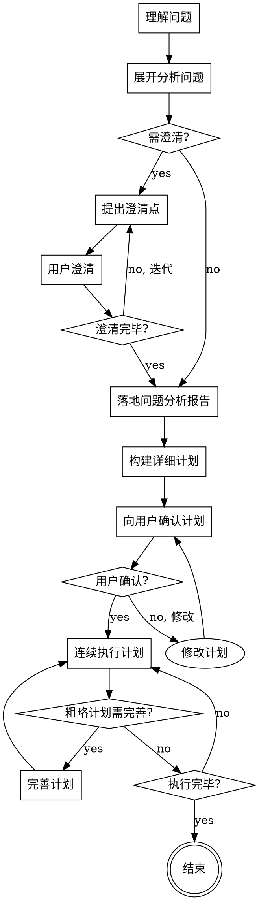

# 不中断长任务执行

## 概述

本技能用于执行需要多步骤、多轮交互、可被拆解为多个小任务、可连续执行的复杂任务。核心目的是完整而正确地实现目标，不受打断，直至计划执行完毕。

## 核心原则

1. **完整优于快速**：不焦虑 token，关注完整而正确地实现
2. **连续执行**：得到确认后，连续执行直至完成，不被打断
3. **可测试性**：关注代码的可测试性
4. **真实性**：关注案例的真实性
5. **动态完善**：执行过程中完善粗略计划，不谋求超大计划，以总计划+多个分计划进行落地
6. **拆解化小**：对问题进行拆解，对输出进行拆解，务求连续执行

## 执行流程



---

## Phase 1: 问题理解与分析

### 1.1 理解问题

- 读取用户输入，理解核心诉求
- 识别问题类型（新功能、bug修复、重构、迁移等）
- 识别涉及的领域（业务、技术、架构等）

### 1.2 展开问题

- 分析问题的输入和输出
- 分析问题的边界和约束
- 分析问题的依赖和前置条件
- 分析问题的风险和挑战

### 1.3 分析问题

- 识别核心难点
- 识别可能的解决方案方向
- 识别需要的资源和技术栈

---

## Phase 2: 澄清需求

### 2.1 提出澄清点

基于问题分析，提出需要澄清的点：

| 类别 | 澄清问题示例 |
|------|--------------|
| 目标 | "核心目的是什么？优先级如何？" |
| 边界 | "哪些场景需要覆盖？哪些不需要？" |
| 技术 | "技术栈约束是什么？兼容性要求？" |
| 数据 | "数据来源？数据量级？数据格式？" |
| 性能 | "性能要求？响应时间？吞吐量？" |
| 安全 | "安全要求？权限控制？敏感数据？" |
| 集成 | "需要集成哪些系统？接口规范？" |

### 2.2 迭代澄清

- 每轮澄清聚焦一个主题
- 根据用户回答深入追问
- 澄清深度逐步递进
- 使用 `question` 工具提出澄清问题

### 2.3 澄清结束条件

满足以下条件时结束澄清：

- [ ] 核心目标明确
- [ ] 边界约束清晰
- [ ] 技术方案方向确定
- [ ] 无重大未知项

---

## Phase 3: 问题分析报告

### 3.1 报告内容

```markdown
# 问题分析报告

## 问题概述
[一句话描述核心问题]

## 问题类型
[新功能/Bug修复/重构/迁移/其他]

## 目标定义
### 核心目标
[主要目标]

### 衡量标准
[如何验证目标达成]

## 边界定义
### 包含范围
[需要覆盖的场景]

### 不包含范围
[明确排除的场景]

## 技术约束
### 技术栈
[使用的技术栈]

### 兼容性要求
[版本、平台兼容性]

### 现有系统约束
[需要适配的现有系统]

## 风险识别
### 技术风险
[技术难点和风险]

### 业务风险
[业务影响和风险]

### 缓解策略
[风险应对策略]

## 依赖识别
### 内部依赖
[依赖的内部模块/服务]

### 外部依赖
[依赖的外部系统/API]

## 输出物定义
### 代码输出
[需要产出的代码]

### 文档输出
[需要产出的文档]

### 其他输出
[测试、配置等]
```

### 3.2 报告输出

写入 `docs/analysis/{yyyymmdd}-{seq}-analysis.md`

---

## Phase 4: 详细计划

### 4.1 计划结构

```markdown
# 执行计划

## 计划概述
[计划总览]

## Phase 1: {阶段名称}
### 目标
[阶段目标]

### 步骤
| 序号 | 步骤 | 输出物 | 验证方式 |
|------|------|--------|----------|
| 1.1 | ... | ... | ... |

### 预估工作量
[时间估算]

## Phase 2: {阶段名称}
### 目标
[阶段目标]

### 步骤
| 序号 | 步骤 | 输出物 | 验证方式 |
|------|------|--------|----------|
| 2.1 | ... | ... | ... |

### 预估工作量
[时间估算]

...

## 验证策略
### 单元验证
[单元测试策略]

### 集成验证
[集成测试策略]

### 端到端验证
[E2E测试策略]

## 回滚策略
[如何回滚]
```

### 4.2 计划粒度

| 阶段 | 粒度要求 |
|------|----------|
| 前期阶段（Phase 1-2） | 详细步骤，精确输出物 |
| 中期阶段（Phase 3-4） | 中等粒度，明确目标 |
| 后期阶段（Phase 5+） | 粗略框架，执行时完善 |

### 4.3 计划输出

写入 `docs/plans/{yyyymmdd}-{seq}-plan.md`

---

## Phase 5: 计划确认

### 5.1 向用户展示计划

使用 `question` 工具展示计划摘要，请求确认：

```
计划已生成，请确认：
1. Phase 1: xxx
2. Phase 2: xxx
...

是否确认开始执行？
```

### 5.2 用户反馈处理

| 反馈 | 处理 |
|------|------|
| 确认执行 | 进入 Phase 6 |
| 修改计划 | 根据反馈修改，重新确认 |
| 取消任务 | 终止执行 |

---

## Phase 6: 连续执行

### 6.1 执行原则

**核心：连续执行，不被打断**

- 使用 `todowrite` 记录执行进度
- 每个步骤完成后立即进入下一个
- 不询问用户中间决策
- 遇到技术问题时自行解决或记录
- 不中断等待用户输入

### 6.2 执行过程完善

当遇到粗略计划阶段：

1. 基于上下文完善步骤细节
2. 补充输出物定义
3. 补充验证方式
4. 继续执行

**不需要回到用户确认，先做完**

### 6.3 执行验证

每个步骤完成后：

- [ ] 输出物已生成
- [ ] 验证方式已执行
- [ ] 结果符合预期

### 6.4 执行记录

每个步骤执行后：

- 更新 `todowrite` 进度
- 记录执行结果到计划文档

---

## Phase 7: 完成总结

### 7.1 完成检查

- [ ] 所有计划步骤已执行
- [ ] 所有输出物已生成
- [ ] 所有验证已通过
- [ ] 无遗留问题

### 7.2 输出总结

```markdown
# 任务完成总结

## 执行概览
[执行过程概述]

## 输出物清单
| 类型 | 文件 | 说明 |
|------|------|------|
| 代码 | xxx.java | ... |
| 文档 | xxx.md | ... |

## 验证结果
[测试结果、验证结果]

## 遗留项
[如有遗留项，列出]

## 后续建议
[后续改进建议]
```

### 7.3 提交代码

执行 git 提交：

```bash
git add .
git commit -m "feat: 完成xxx任务"
```

---

## 可用技能

执行过程中可调用以下技能：

| 技能 | 用途 |
|------|------|
| `code-review` | 代码审查 |
| `code-deconstruct` | 解构代码生成设计文档 |
| `code-refactor` | 重构方法论 |
| `java-compile` | Java 编译 |
| `java-gen-unittest` | Java 单元测试生成 |
| `merge-agents-md` | 合并 AGENTS.md |
| `jmh-bench` | JMH 基准测试 |
| `java-asprof` | Java 性能分析 |

可通过 `/skills` 了解完整能力列表。

---

## 异常处理

### 执行受阻

| 情况 | 处理 |
|------|------|
| 技术阻塞 | 记录问题，尝试替代方案，继续执行 |
| 资源缺失 | 记录依赖，使用 mock/stub，继续执行 |
| 验证失败 | 分析原因，修复问题，重新验证 |

### 用户中断

- 用户明确要求停止：停止执行，输出当前进度
- 用户提出修改：记录修改，继续执行（不重启）

---

## Token 使用原则

1. **不焦虑 token 消耗**
2. **优先保证完整性和正确性**
3. **关键步骤详细记录**
4. **复杂逻辑完整实现**
5. **测试案例真实可用**

---

## 执行检查清单

**开始执行前：**
- [ ] 问题分析报告已输出
- [ ] 详细计划已输出
- [ ] 用户已确认计划

**执行过程中：**
- [ ] todowrite 记录进度
- [ ] 每步骤输出物已生成
- [ ] 粗略计划已完善
- [ ] 执行结果已记录

**执行结束后：**
- [ ] 所有步骤已完成
- [ ] 所有验证已通过
- [ ] 完成总结已输出
- [ ] Git 已提交
