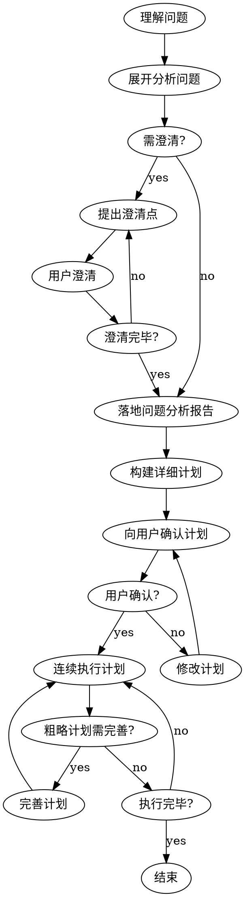

# 不中断长任务执行

<HARD-GATE>
**强制约束：必须连续执行，不能被打断**

1. 一旦问题已清晰，需求已明确，计划已制定，必须完整地实现目标。
2. 执行过程中，不要暂停，直至所有 `TODO` 都完成。
3. 完整优于快速。
4. 测试必须完备，单元测试和集成测试。

违反以上约束视为执行失败，必须重新执行。
</HARD-GATE>

## 核心原则

1. **完整优于快速**：关注完整而正确地实现，不要急于交付
2. **连续执行**：得到确认后，连续执行直至完成，不被打断
3. **可测试性**：关注代码的可测试性
4. **真实性**：关注案例的真实性
5. **动态完善**：执行过程中完善粗略计划，以总计划+多个分计划进行落地
6. **拆解化小**：对问题和输出进行拆解，务求连续执行

## 执行流程



## Phase 1: 问题理解与分析

1. **理解问题**：读取用户输入，识别问题类型和涉及领域
2. **展开问题**：分析输入/输出、边界约束、依赖前置条件、风险挑战
3. **分析问题**：识别核心难点、解决方案方向、所需资源和技术栈

## Phase 2: 澄清需求

### 澄清维度

| 类别 | 澄清问题示例 |
|------|--------------|
| 目标 | "核心目的是什么？优先级如何？" |
| 边界 | "哪些场景需要覆盖？哪些不需要？" |
| 技术 | "技术栈约束是什么？兼容性要求？" |
| 数据 | "数据来源？数据量级？数据格式？" |
| 性能 | "性能要求？响应时间？吞吐量？" |
| 安全 | "安全要求？权限控制？敏感数据？" |
| 集成 | "需要集成哪些系统？接口规范？" |

### 澄清规则

- 每轮聚焦一个主题，根据回答深入追问，深度逐步递进
- 结束条件：核心目标明确、边界约束清晰、技术方案方向确定、无重大未知项

## Phase 3: 问题分析报告

使用模板 `templates/analysis-report.md`，输出到 `docs/analysis/{yyyymmdd}-{seq}-analysis.md`。

## Phase 4: 详细计划

使用模板 `templates/execution-plan.md`，输出到 `docs/plans/{yyyymmdd}-{seq}-plan.md`。

### 计划粒度

| 阶段 | 粒度要求 |
|------|----------|
| 前期阶段（Phase 1-2） | 详细步骤，精确输出物 |
| 中期阶段（Phase 3-4） | 中等粒度，明确目标 |
| 后期阶段（Phase 5+） | 粗略框架，执行时完善 |

## Phase 5: 计划确认

向用户展示计划摘要，请求确认：

```text
计划已生成，请确认：
1. Phase 1: xxx
2. Phase 2: xxx
...
是否确认开始执行？
```

| 反馈 | 处理 |
|------|------|
| 确认执行 | 进入 Phase 6 |
| 修改计划 | 根据反馈修改，重新确认 |
| 取消任务 | 终止执行 |

## Phase 6: 连续执行

**核心：连续执行，不被打断**

- 使用 `todowrite` 记录执行进度，每步完成后立即进入下一个
- 不询问用户中间决策，遇到技术问题自行解决或记录
- 遇到粗略计划阶段：基于上下文完善步骤细节，**不需要回到用户确认，先做完**
- 每步验证：输出物已生成、验证方式已执行、结果符合预期

## Phase 7: 完成总结

使用模板 `templates/completion-summary.md` 输出总结。

### 完成检查

- [ ] 所有计划步骤已执行
- [ ] 所有输出物已生成
- [ ] 所有验证已通过
- [ ] 无遗留问题

### 提交代码

```bash
git add .
git commit -m "feat: 完成xxx任务"
```

## 异常处理

| 情况 | 处理 |
|------|------|
| 技术阻塞 | 记录问题，尝试替代方案，继续执行 |
| 资源缺失 | 记录依赖，使用 mock/stub，继续执行 |
| 验证失败 | 分析原因，修复问题，重新验证 |
| 用户明确停止 | 停止执行，输出当前进度 |
| 用户提出修改 | 记录修改，继续执行（不重启） |

## 执行检查清单

**开始执行前：**

- [ ] 问题分析报告已输出
- [ ] 详细计划已输出
- [ ] 用户已确认计划

**执行过程中：**

- [ ] todowrite 记录进度
- [ ] 每步骤输出物已生成
- [ ] 粗略计划已完善
- [ ] 执行结果已记录

**执行结束后：**

- [ ] 所有步骤已完成
- [ ] 所有验证已通过
- [ ] 完成总结已输出
- [ ] Git 已提交
