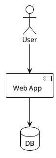

# Markdown to PDF Converter

将 Markdown 文件转换为 PDF，支持 Mermaid 和 PlantUML 图表自动渲染。

## 功能特性

- 支持中文 (Noto Serif CJK SC)
- 支持 emoji (Symbola 字体)
- 支持 Markdown 表格
- 支持 ASCII 表格 (等宽字体)
- **支持 Mermaid 图表** - 自动转换为 PNG 嵌入 PDF
- **支持 PlantUML 图表** - 自动转换为 PNG 嵌入 PDF

## 依赖

### 必需
- `pandoc` - Markdown 转换
- `xelatex` - PDF 引擎
- `curl` - 图表渲染 (Kroki API)

### 可选
- `mmdc` (mermaid-cli) - Mermaid 本地渲染
- `/usr/share/plantuml/plantuml.jar` - PlantUML 本地渲染

### 字体
- `fonts-noto-cjk` - 中文字体
- `fonts-symbola` - emoji 支持
- `fonts-dejavu` - 代码块

## 用法

```bash
# 转换单个文件
md2pdf <markdown_file> [output_pdf]

# 批量转换
md2pdf docs/review/*.md
```

### 示例

```bash
# 转换单个文件
md2pdf docs/review/code-review-20260702-001.md

# 指定输出路径
md2pdf input.md output.pdf

# 批量转换
md2pdf docs/*.md
```

## 图表支持

### Mermaid 图表

在 Markdown 中使用 ` ```mermaid ` 代码块：

````markdown

````

支持的 Mermaid 图表类型：
- Flowchart (`flowchart TD/LR`)
- Sequence (`sequenceDiagram`)
- Class (`classDiagram`)
- ER (`erDiagram`)
- State (`stateDiagram-v2`)
- Gantt (`gantt`)
- Pie (`pie`)
- Git Graph (`gitGraph`)
- Mind Map (`mindmap`)

### PlantUML 图表

在 Markdown 中使用 ` ```plantuml ` 代码块：

````markdown

````

支持的 PlantUML 图表类型：
- Sequence
- Component
- Class
- ER / Entity
- Activity
- Use Case
- State
- C4 Context
- Mind Map
- Gantt

## 渲染流程

### Mermaid 渲染
1. 检测本地 `mmdc` 工具
2. 若可用，使用本地渲染（更快、离线）
3. 若不可用，使用 Kroki API 渲染

### PlantUML 渲染
1. 检测本地 `/usr/share/plantuml/plantuml.jar`
2. 若可用，使用本地渲染（更快、离线）
3. 若不可用，使用 Kroki API 渲染

## 输出特性

- 自动生成目录 (TOC)
- 目录深度: 3 级
- 页边距: 2cm
- 字体大小: 11pt
- 页面宽度: 80 列

## 错误处理

- 图表渲染失败时，脚本会显示警告但继续转换
- 图表代码块会被移除，避免在 PDF 中显示原始代码

## 安装脚本

脚本位置: `LinuxEnv/bin/md2pdf`

确保脚本有执行权限：
```bash
chmod +x LinuxEnv/bin/md2pdf
```

## 示例对话

**用户**: "把这个 markdown 转成 pdf"

**助手**: 
```bash
md2pdf /path/to/document.md
```

**用户**: "我的文档里有 mermaid 图，能转 pdf 吗？"

**助手**: 
```bash
md2pdf document.md
# 自动检测并渲染 mermaid 图表
```