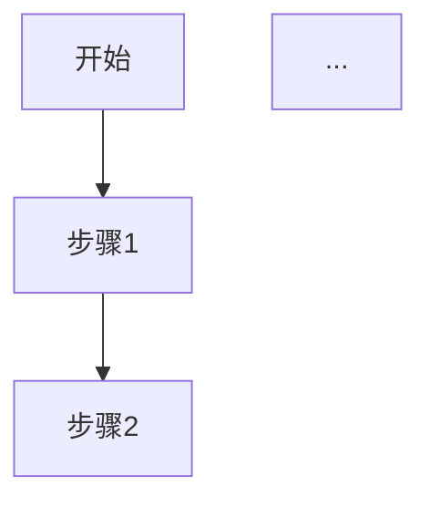
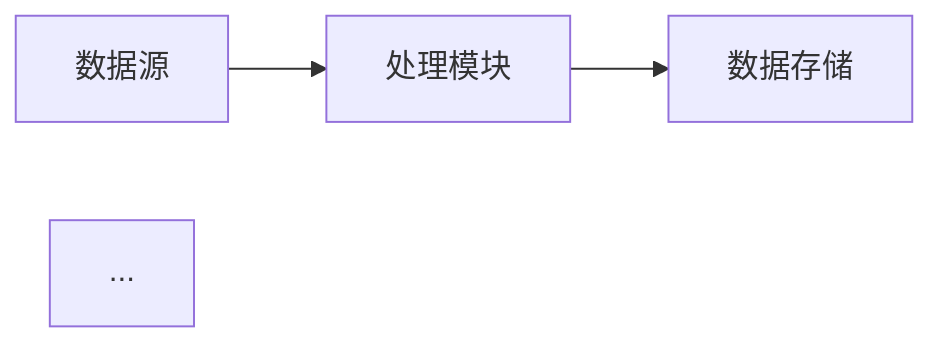
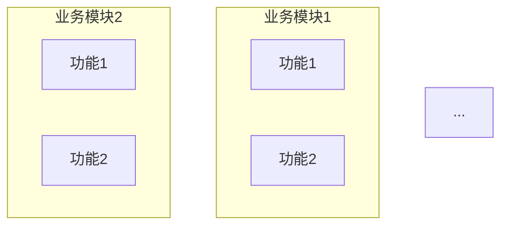
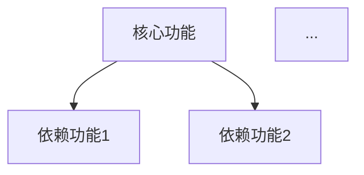

# 源代码解构（需求）

<HARD-GATE>
**强制约束：必须对所有模块进行梳理，不得偷工减料**

1. 所有源代码包/模块必须逐一分析，不得跳过任何模块
2. 每个模块的需求文档必须完整包含所有章节
3. 业务规则必须从代码中深度挖掘，不得遗漏
4. 执行进度必须使用 todowrite 记录，确保可追溯
5. 最终输出必须通过完整性检查清单验证

违反以上约束视为执行失败，必须重新执行。
</HARD-GATE>

## 需求收集流程

**核心原则**：从代码逆向提炼需求，完整收集业务意图

### 执行步骤

1. **扫描项目结构**：列出所有包/模块，形成完整模块清单
2. **逐一分析模块**：按模块清单顺序，逐个深入分析
3. **挖掘业务规则**：从每个模块代码中深度挖掘业务规则
4. **编写需求文档**：为每个模块生成完整需求文档
5. **汇总全局需求**：整合所有模块需求，生成全局需求文档

### 进度记录

使用 `todowrite` 记录执行进度：

```
- [ ] 扫描项目结构，列出模块清单
- [ ] 分析模块: {module1}
- [ ] 分析模块: {module2}
- [ ] ...
- [ ] 汇总全局需求文档
- [ ] 完整性检查
```

## 模块梳理强制要求

### 模块清单生成

**必须**生成完整的模块清单文档：`docs/requirements/module_inventory.md`

```markdown
# 模块清单

## 项目结构
| 序号 | 模块路径 | 模块名称 | 文件数 | 主要职责 | 分析状态 |
|------|----------|----------|--------|----------|----------|
| 1 | src/main/java/com/xxx/module1 | 模块1 | 15 | xxx | 已完成 |
| 2 | src/main/java/com/xxx/module2 | 模块2 | 23 | xxx | 进行中 |
| ... | ... | ... | ... | ... | 待分析 |

## 模块总数
总计: {N} 个模块

## 分析进度
已完成: {M}/{N} 个模块
```

### 模块分析顺序

按以下顺序分析，不得跳过：

1. 核心业务模块优先
2. 辅助功能模块次之
3. 工具/配置模块最后

### 模块分析完整性

每个模块分析必须包含：

| 分析内容 | 必须产出 | 不得省略 |
|----------|----------|----------|
| 业务场景 | 场景列表 + 场景详情 | ❌ |
| 功能需求 | 核心功能 + 辅助功能 | ❌ |
| 业务规则 | 规则列表 + 规则详情（独立章节） | ❌ |
| 数据需求 | 数据实体 + 数据流转 | ❌ |
| 非功能需求 | 性能 + 安全 + 可用性 | ❌ |
| 约束条件 | 业务约束 + 技术约束 | ❌ |

---

## 业务规则挖掘（强制章节）

<HARD-GATE>
**业务规则必须独立成章节写入分模块文档，不得遗漏或简化**
</HARD-GATE>

### 什么是业务规则

业务规则是代码中体现的业务逻辑约束、计算规则、状态转换规则等。它们往往深埋在代码中，需要深度挖掘。

### 业务规则挖掘方法

#### 1. 从条件判断中挖掘

```java
// 代码示例
if (user.getAge() >= 18 && user.getStatus() == Status.ACTIVE) {
    // 业务规则：成年人且状态为活跃才可执行某操作
}
```

**挖掘规则**：
| 规则名称 | 规则描述 | 代码位置 | 适用场景 |
|----------|----------|----------|----------|
| 用户操作权限 | 用户必须年满18岁且状态为活跃才可执行某操作 | UserService.java:45 | 用户操作验证 |

#### 2. 从计算逻辑中挖掘

```java
// 代码示例
double interest = principal * rate * days / 365;
if (interest > 10000) {
    interest = interest * 0.95; // 大额利息优惠
}
```

**挖掘规则**：
| 规则名称 | 规则描述 | 代码位置 | 适用场景 |
|----------|----------|----------|----------|
| 利息计算 | 利息 = 本金 × 利率 × 天数 / 365 | InterestService.java:100 | 利息计算 |
| 大额优惠 | 利息超过10000时享受5%优惠 | InterestService.java:102 | 大额利息处理 |

#### 3. 从状态转换中挖掘

```java
// 代码示例
switch (order.getStatus()) {
    case PENDING:
        if (paymentSuccess) order.setStatus(PAID);
        break;
    case PAID:
        if (shipped) order.setStatus(SHIPPED);
        break;
}
```

**挖掘规则**：
| 规则名称 | 规则描述 | 代码位置 | 适用场景 |
|----------|----------|----------|----------|
| 订单状态转换-支付 | 待支付订单支付成功后转为已支付 | OrderService.java:80 | 订单支付 |
| 订单状态转换-发货 | 已支付订单发货后转为已发货 | OrderService.java:82 | 订单发货 |

#### 4. 从数据验证中挖掘

```java
// 代码示例
if (email == null || !email.matches("^[A-Za-z0-9+_.-]+@(.+)$")) {
    throw new ValidationException("邮箱格式无效");
}
```

**挖掘规则**：
| 规则名称 | 规则描述 | 代码位置 | 适用场景 |
|----------|----------|----------|----------|
| 邮箱格式验证 | 邮箱必须符合标准格式 | Validator.java:30 | 用户注册 |

#### 5. 从异常处理中挖掘

```java
// 代码示例
try {
    transfer(fromAccount, toAccount, amount);
} catch (InsufficientBalanceException e) {
    // 业务规则：余额不足时转账失败
    rollback();
}
```

**挖掘规则**：
| 规则名称 | 规则描述 | 代码位置 | 适用场景 |
|----------|----------|----------|----------|
| 转账余额验证 | 转账时账户余额必须充足 | TransferService.java:55 | 转账操作 |

#### 6. 从常量/配置中挖掘

```java
// 代码示例
public static final int MAX_RETRY = 3;
public static final long SESSION_TIMEOUT = 30 * 60 * 1000; // 30分钟
```

**挖掘规则**：
| 规则名称 | 规则描述 | 代码位置 | 适用场景 |
|----------|----------|----------|----------|
| 重试次数上限 | 最大重试次数为3次 | Constants.java:10 | 操作重试 |
| 会话超时 | 会话超时时间为30分钟 | Constants.java:11 | 会话管理 |

#### 7. 从数据库约束中挖掘

```sql
-- 数据库示例
CREATE TABLE user (
    age INT CHECK (age >= 0 AND age <= 150),
    status VARCHAR(10) DEFAULT 'ACTIVE'
);
```

**挖掘规则**：
| 规则名称 | 规则描述 | 数据库位置 | 适用场景 |
|----------|----------|------------|----------|
| 年龄范围 | 年龄必须在0-150之间 | user.age CHECK | 用户数据 |
| 默认状态 | 新用户默认状态为活跃 | user.status DEFAULT | 用户创建 |

#### 8. 从注释/文档中挖掘

```java
// 注释示例
/**
 * 根据用户等级计算折扣：
 * - VIP用户：20%折扣
 * - 普通用户：无折扣
 */
public double calculateDiscount(User user) { ... }
```

**挖掘规则**：
| 规则名称 | 规则描述 | 代码位置 | 适用场景 |
|----------|----------|----------|----------|
| VIP折扣 | VIP用户享受20%折扣 | DiscountService.java | 折扣计算 |

### 业务规则章节模板

每个模块的需求文档必须包含独立的业务规则章节：

```markdown
## 业务规则（深度挖掘）

### 规则分类

| 分类 | 规则数量 | 说明 |
|------|----------|------|
| 数据验证规则 | {N} | 输入数据验证 |
| 状态转换规则 | {N} | 状态流转规则 |
| 计算规则 | {N} | 数值/金额计算 |
| 权限规则 | {N} | 操作权限控制 |
| 时间规则 | {N} | 时间相关限制 |
| 配额规则 | {N} | 数量/次数限制 |
| 业务约束 | {N} | 其他业务约束 |

### 规则详情

#### 数据验证规则

| 规则ID | 规则名称 | 规则描述 | 触发条件 | 代码位置 | 异常处理 |
|--------|----------|----------|----------|----------|----------|
| BR-001 | 用户名验证 | 用户名长度3-20字符 | 用户注册 | UserService.java:25 | 抛出异常 |
| BR-002 | ... | ... | ... | ... | ... |

#### 状态转换规则

| 规则ID | 规则名称 | 当前状态 | 目标状态 | 触发条件 | 代码位置 |
|--------|----------|----------|----------|----------|----------|
| BR-ST01 | 订单支付 | PENDING | PAID | 支付成功 | OrderService.java:80 |
| BR-ST02 | ... | ... | ... | ... | ... |

#### 计算规则

| 规则ID | 规则名称 | 计算公式 | 边界条件 | 代码位置 | 说明 |
|--------|----------|----------|----------|----------|------|
| BR-C01 | 利息计算 | 本金×利率×天数/365 | 利息>10000时优惠5% | InterestService.java:100 | 年化利息 |
| BR-C02 | ... | ... | ... | ... | ... |

#### 权限规则

| 规则ID | 规则名称 | 规则描述 | 适用角色 | 代码位置 |
|--------|----------|----------|----------|----------|
| BR-P01 | 管理员权限 | 仅管理员可删除用户 | ADMIN | PermissionService.java:30 |
| BR-P02 | ... | ... | ... | ... |

#### 时间规则

| 规则ID | 规则名称 | 规则描述 | 时间参数 | 代码位置 |
|--------|----------|----------|----------|----------|
| BR-T01 | 会话超时 | 会话超时30分钟自动失效 | 30min | SessionService.java:50 |
| BR-T02 | ... | ... | ... | ... |

#### 配额规则

| 规则ID | 规则名称 | 规则描述 | 配额限制 | 代码位置 |
|--------|----------|----------|----------|----------|
| BR-Q01 | 重试限制 | 最大重试次数为3次 | 3次 | RetryService.java:20 |
| BR-Q02 | ... | ... | ... | ... |

#### 其他业务约束

| 规则ID | 规则名称 | 规则描述 | 适用场景 | 代码位置 |
|--------|----------|----------|----------|----------|
| BR-X01 | ... | ... | ... | ... |

### 规则冲突分析

[识别是否存在规则冲突，如何处理]

### 规则遗漏风险

[识别可能遗漏的业务规则，需要补充验证]
```

---

## 需求分析维度

### 业务需求

从代码中识别业务需求：

| 分析维度 | 内容 |
|----------|------|
| 业务场景 | 代码支持的业务场景有哪些 |
| 业务流程 | 业务流程是如何实现的 |
| 业务规则 | 代码中体现的业务规则（必须深度挖掘） |
| 业务约束 | 代码中体现的业务约束 |

### 功能需求

从代码中识别功能需求：

| 分析维度 | 内容 |
|----------|------|
| 核心功能 | 代码实现的核心功能 |
| 辅助功能 | 代码实现的辅助功能 |
| 边界条件 | 代码处理的边界条件 |
| 异常处理 | 代码处理的异常情况 |

### 非功能需求

从代码中识别非功能需求：

| 分析维度 | 内容 |
|----------|------|
| 性能要求 | 代码中的性能设计 |
| 安全要求 | 代码中的安全设计 |
| 可用性要求 | 代码中的可用性设计 |
| 兼容性要求 | 代码中的兼容性设计 |

### 数据需求

从代码和数据库中识别数据需求：

| 分析维度 | 内容 |
|----------|------|
| 数据实体 | 代码/数据库涉及的数据实体 |
| 数据关系 | 数据实体之间的关系 |
| 数据约束 | 数据的约束条件 |
| 数据流转 | 数据的流转路径 |

---

## 需求文档结构

### 分模块需求文档

文件：`docs/requirements/{package}/requirements.md`

```markdown
# {模块名称} 需求文档

## 模块概述
[模块简介、在系统中的定位]

## 业务场景
### 场景列表
| 序号 | 场景名称 | 描述 | 优先级 |
|------|----------|------|--------|

### 场景详情
#### 场景1: {场景名称}
**触发条件**：[什么情况下触发]
**业务流程**：

**预期结果**：[期望的结果]

## 功能需求
### 核心功能
| 序号 | 功能名称 | 描述 | 输入 | 输出 |
|------|----------|------|------|------|

### 辅助功能
| 序号 | 功能名称 | 描述 | 输入 | 输出 |
|------|----------|------|------|------|

## 业务规则（深度挖掘）
**[必须包含完整的业务规则章节，不得省略]**

### 规则分类
| 分类 | 规则数量 | 说明 |
|------|----------|------|

### 规则详情
[详见业务规则章节模板]

## 数据需求
### 数据实体
| 实体名称 | 属性列表 | 来源 |

### 数据流转


## 非功能需求
### 性能要求
[性能指标]

### 安全要求
[安全要求]

## 约束条件
[业务约束、技术约束]
```

### 全局需求文档

文件：`docs/requirements/global_requirements.md`

```markdown
# 项目需求文档

## 项目概述
[项目简介、目的、定位]

## 模块清单
[引用 module_inventory.md]

## 业务全景
### 业务领域
[业务领域描述]

### 业务架构


## 功能全景
### 功能列表
| 模块 | 功能 | 优先级 | 状态 |
|------|------|--------|------|

### 功能依赖


## 业务规则汇总
### 规则统计
| 模块 | 规则数量 | 主要规则类型 |
|------|----------|--------------|

### 规则详情索引
| 模块 | 规则文档位置 |
|------|--------------|

## 数据全景
### 数据实体清单
| 实体 | 属性 | 来源 | 存储位置 |
|------|------|------|----------|

### 数据关系图
```mermaid
erDiagram
    ENTITY1 ||--o{ ENTITY2 : contains
    ENTITY1 {
        string id PK
        string name
    }
    ...
```

### 数据流转图


## 非功能需求
### 性能要求
| 指标 | 要求 | 当前实现 |
|------|------|----------|

### 安全要求
| 要求 | 实现方式 |
|------|----------|

### 可用性要求
| 要求 | 实现方式 |
|------|----------|

### 兼容性要求
| 类型 | 要求 |
|------|------|

## 需求优先级
| 优先级 | 需求 | 理由 |
|--------|------|------|

## 需求缺口分析
### 未实现需求
[代码中未实现但应该有的需求]

### 过实现需求
[代码中实现但实际不需要的需求]

## 附录
### 相关文档
- 模块清单：`docs/requirements/module_inventory.md`
- 设计文档：`docs/deconstruct/global_design.md`
- 数据库设计：`docs/deconstruct/database/database_design.md`
```

---

## 源代码类型

### 直接源码文件

| 类型 | 文件扩展名 | 说明 |
|------|------------|------|
| Java | `*.java` | Java源码 |
| Python | `*.py` | Python源码 |
| C++ | `*.cpp *.hpp *.cxx *.hxx` | C++源码和头文件 |
| ANSI C | `*.c *.h` | C源码和头文件 |
| JavaScript | `*.js *.mjs *.cjs` | JavaScript源码 |
| TypeScript | `*.ts *.tsx *.mts *.cts` | TypeScript源码 |
| Rust | `*.rs` | Rust源码 |
| Go | `*.go` | Go源码 |
| Kotlin | `*.kt *.kts` | Kotlin源码 |
| Scala | `*.scala *.sc` | Scala源码 |
| Shell | `*.sh *.bash *.zsh` | Shell脚本 |
| Batch | `*.bat *.cmd *.ps1` | Windows脚本 |

### SQL 来源（需拼接提取）

| 来源类型 | 文件/位置 | 提取方法 |
|----------|-----------|----------|
| SQL文件 | `*.sql` | 直接读取 |
| MyBatis Mapper | `**/*Mapper.xml **/*mapper.xml` | 从 `<sql>` `<select>` `<insert>` `<update>` `<delete>` 标签提取 |
| iBATIS SqlMap | `**/*SqlMap.xml **/sqlmap*.xml` | 从 SQL 标签提取 |
| Hibernate HQL | `*.java` | 从 `@NamedQuery` 注解、HQL字符串提取 |
| JPA SQL | `*.java` | 从 `@Query` 注解提取 |
| Java字符串SQL | `*.java` | 从字符串常量、方法内SQL拼接提取 |
| Python SQL | `*.py` | 从字符串、SQLAlchemy语句提取 |
| 内嵌SQL | 各种源码 | 正则匹配SQL关键字模式 |

### SQL 拼接提取规则

```python
# 伪代码示例：提取散落的SQL

# 1. MyBatis Mapper 提取
def extract_mybatis_sql(xml_file):
    # 提取 <sql id="xxx"> 内容
    # 提取 <select/insert/update/delete> 内容
    # 合并 <include refid="xxx"> 引用
    # 替换 ${param} 和 #{param} 参数占位符

# 2. Java字符串SQL提取
def extract_java_sql(java_file):
    # 匹配模式："SELECT ..." 或 "INSERT ..." 
    # 匹配模式：String sql = "..."; 
    # 拼接多行字符串：sql += "..."
    # 提取 StringBuilder.append("...") 拼接

# 3. 注解SQL提取
def extract_annotation_sql(java_file):
    # @Query("SELECT ...")
    # @NamedQuery(name="xxx", query="SELECT ...")
```

### SQL 提取正则模式

```regex
# SQL关键字匹配
(SELECT|INSERT|UPDATE|DELETE|CREATE|ALTER|DROP|TRUNCATE)\s+

# MyBatis SQL标签
<sql[^>]*id="([^"]+)"[^>]*>(.*?)</sql>
<select[^>]*>(.*?)</select>

# Java字符串SQL
"(SELECT|INSERT|UPDATE|DELETE)[^"]*"
String\s+\w+\s*=\s*"([^"]*(?:SELECT|INSERT|UPDATE|DELETE)[^"]*)"

# Python字符串SQL
""".*(?:SELECT|INSERT|UPDATE|DELETE).*"""
'.*(?:SELECT|INSERT|UPDATE|DELETE).*'
```

---

## 输出目录结构

```
docs/requirements/
├── module_inventory.md           # 模块清单（必须）
├── global_requirements.md        # 全局需求文档
├── {package}/                    # 分模块需求文档
│   └── requirements.md
└── ...
```

---

## 需求收集技巧

### 从代码中识别需求

| 代码特征 | 需求类型 |
|----------|----------|
| Controller 层 | API 接口需求 |
| Service 层 | 业务逻辑需求 |
| DAO 层 | 数据访问需求 |
| 配置文件 | 配置需求 |
| 异常处理 | 异常场景需求 |
| 日志记录 | 可观测性需求 |
| 注释/文档 | 业务规则线索 |

### 从数据库中识别需求

| 数据库特征 | 需求类型 |
|------------|----------|
| 表结构 | 数据实体需求 |
| 字段约束 | 业务规则需求 |
| 索引 | 性能需求 |
| 外键 | 数据关系需求 |
| 触发器 | 自动化需求 |

### 从测试中识别需求

| 测试特征 | 需求类型 |
|----------|----------|
| 测试场景 | 业务场景需求 |
| 测试数据 | 数据需求 |
| 边界测试 | 边界条件需求 |
| 异常测试 | 异常处理需求 |

---

## 完整性检查清单

<HARD-GATE>
**执行完成后必须通过以下检查，否则视为执行失败**
</HARD-GATE>

### 模块覆盖检查

- [ ] 所有模块已列入 `module_inventory.md`
- [ ] 所有模块均有对应的需求文档
- [ ] 需求文档数量与模块数量一致
- [ ] 无遗漏的模块

### 文档完整性检查

每个模块需求文档必须包含：

- [ ] 模块概述章节
- [ ] 业务场景章节（含场景列表+场景详情）
- [ ] 功能需求章节（含核心功能+辅助功能）
- [ ] 业务规则章节（独立章节，含规则分类+规则详情）
- [ ] 数据需求章节（含数据实体+数据流转）
- [ ] 非功能需求章节
- [ ] 约束条件章节

### 业务规则检查

- [ ] 业务规则已从代码中深度挖掘
- [ ] 业务规则已分类整理
- [ ] 每条规则有代码位置引用
- [ ] 规则详情包含触发条件、适用场景
- [ ] 无遗漏的重要业务规则

### 全局文档检查

- [ ] 模块清单已生成
- [ ] 全局需求文档已生成
- [ ] 业务规则汇总章节存在
- [ ] 功能全景章节存在
- [ ] 数据全景章节存在

---

## 关联技能

设计解构请使用技能：`code-deconstruct`