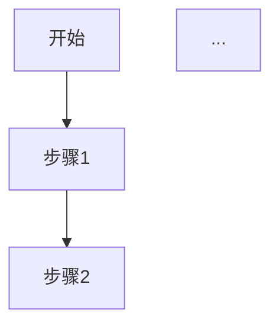
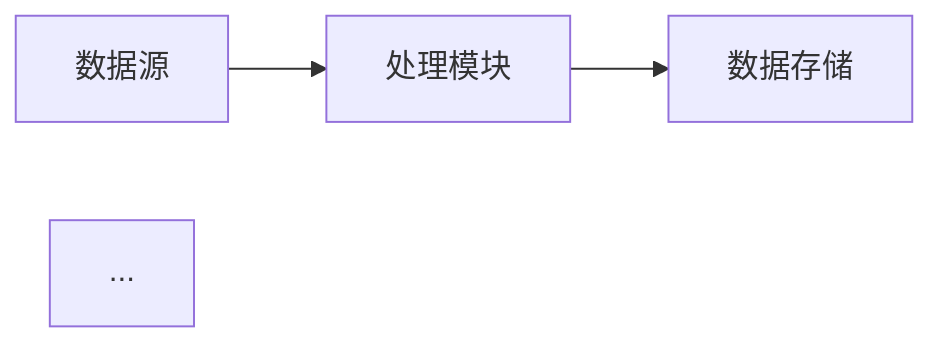
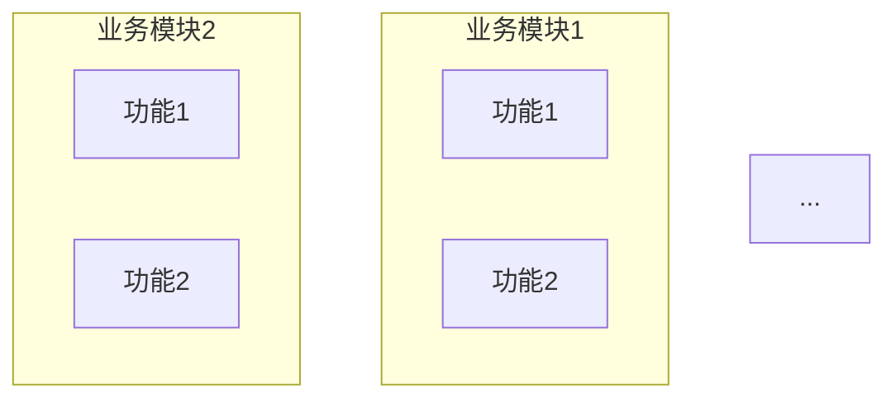
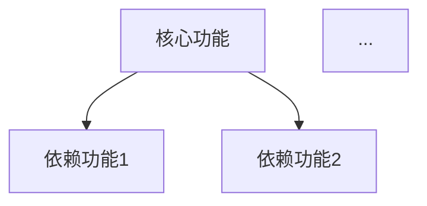

# 源代码解构（需求）

## 需求收集流程

**核心原则**：从代码逆向提炼需求，完整收集业务意图

1. 读取所有源代码，感知项目目的/意图/结构，以及代码之间关系
2. 分析代码功能模块，识别业务场景
3. 将代码结构分模块编写需求文档，格式: `markdown`，可辅以 `mermaid`，写入 `docs/requirements/{package}/requirements.md`
4. 汇总所有模块的需求后，写出全项目需求文档，格式: `markdown`，可辅以 `mermaid`，写入 `docs/requirements/global_requirements.md`

## 需求分析维度

### 业务需求

从代码中识别业务需求：

| 分析维度 | 内容 |
|----------|------|
| 业务场景 | 代码支持的业务场景有哪些 |
| 业务流程 | 业务流程是如何实现的 |
| 业务规则 | 代码中体现的业务规则 |
| 业务约束 | 代码中体现的业务约束 |

### 功能需求

从代码中识别功能需求：

| 分析维度 | 内容 |
|----------|------|
| 核心功能 | 代码实现的核心功能 |
| 辅助功能 | 代码实现的辅助功能 |
| 边界条件 | 代码处理的边界条件 |
| 异常处理 | 代码处理的异常情况 |

### 非功能需求

从代码中识别非功能需求：

| 分析维度 | 内容 |
|----------|------|
| 性能要求 | 代码中的性能设计 |
| 安全要求 | 代码中的安全设计 |
| 可用性要求 | 代码中的可用性设计 |
| 兼容性要求 | 代码中的兼容性设计 |

### 数据需求

从代码和数据库中识别数据需求：

| 分析维度 | 内容 |
|----------|------|
| 数据实体 | 代码/数据库涉及的数据实体 |
| 数据关系 | 数据实体之间的关系 |
| 数据约束 | 数据的约束条件 |
| 数据流转 | 数据的流转路径 |

## 需求文档结构

### 分模块需求文档

文件：`docs/requirements/{package}/requirements.md`

```markdown
# {模块名称} 需求文档

## 模块概述
[模块简介、在系统中的定位]

## 业务场景
### 场景列表
| 序号 | 场景名称 | 描述 | 优先级 |
|------|----------|------|--------|

### 场景详情
#### 场景1: {场景名称}
**触发条件**：[什么情况下触发]
**业务流程**：

**预期结果**：[期望的结果]

## 功能需求
### 核心功能
| 序号 | 功能名称 | 描述 | 输入 | 输出 |
|------|----------|------|------|------|

### 辅助功能
| 序号 | 功能名称 | 描述 | 输入 | 输出 |
|------|----------|------|------|------|

## 业务规则
| 序号 | 规则名称 | 规则描述 | 代码实现位置 |
|------|----------|----------|--------------|

## 数据需求
### 数据实体
| 实体名称 | 属性列表 | 来源 |
|----------|----------|------|

### 数据流转


## 非功能需求
### 性能要求
[性能指标]

### 安全要求
[安全要求]

## 约束条件
[业务约束、技术约束]
```

### 全局需求文档

文件：`docs/requirements/global_requirements.md`

```markdown
# 项目需求文档

## 项目概述
[项目简介、目的、定位]

## 业务全景
### 业务领域
[业务领域描述]

### 业务架构


## 功能全景
### 功能列表
| 模块 | 功能 | 优先级 | 状态 |
|------|------|--------|------|

### 功能依赖


## 业务规则汇总
| 模块 | 规则 | 适用范围 |
|------|------|----------|

## 数据全景
### 数据实体清单
| 实体 | 属性 | 来源 | 存储位置 |
|------|------|------|----------|

### 数据关系图
```mermaid
erDiagram
    ENTITY1 ||--o{ ENTITY2 : contains
    ENTITY1 {
        string id PK
        string name
    }
    ...
```

### 数据流转图


## 非功能需求
### 性能要求
| 指标 | 要求 | 当前实现 |
|------|------|----------|

### 安全要求
| 要求 | 实现方式 |
|------|----------|

### 可用性要求
| 要求 | 实现方式 |
|------|----------|

### 兼容性要求
| 类型 | 要求 |
|------|------|

## 需求优先级
| 优先级 | 需求 | 理由 |
|--------|------|------|

## 需求缺口分析
### 未实现需求
[代码中未实现但应该有的需求]

### 过实现需求
[代码中实现但实际不需要的需求]

## 附录
### 相关文档
- 设计文档：`docs/deconstruct/global_design.md`
- 数据库设计：`docs/deconstruct/database/database_design.md`
```

## 源代码类型

- java: `*.java`
- ansi c: `*.c/*.h`
- cpp: `*.cpp/*.hpp/*.c/*.h`
- javascript: `*.js/*.ts`
- python: `*.py`
- rust: `*.rs`
- sql: `*.sql`
- script: `*.sh/*.bat/*.cmd`

## 输出目录结构

```
docs/requirements/
├── global_requirements.md       # 全局需求文档
├── {package}/                   # 分模块需求文档
│   └── requirements.md
└── ...
```

## 需求收集技巧

### 从代码中识别需求

| 代码特征 | 需求类型 |
|----------|----------|
| Controller 层 | API 接口需求 |
| Service 层 | 业务逻辑需求 |
| DAO 层 | 数据访问需求 |
| 配置文件 | 配置需求 |
| 异常处理 | 异常场景需求 |
| 日志记录 | 可观测性需求 |
| 注释/文档 | 业务规则线索 |

### 从数据库中识别需求

| 数据库特征 | 需求类型 |
|------------|----------|
| 表结构 | 数据实体需求 |
| 字段约束 | 业务规则需求 |
| 索引 | 性能需求 |
| 外键 | 数据关系需求 |
| 触发器 | 自动化需求 |

### 从测试中识别需求

| 测试特征 | 需求类型 |
|----------|----------|
| 测试场景 | 业务场景需求 |
| 测试数据 | 数据需求 |
| 边界测试 | 边界条件需求 |
| 异常测试 | 异常处理需求 |

## 关联技能

设计解构请使用技能：`code-deconstruct`