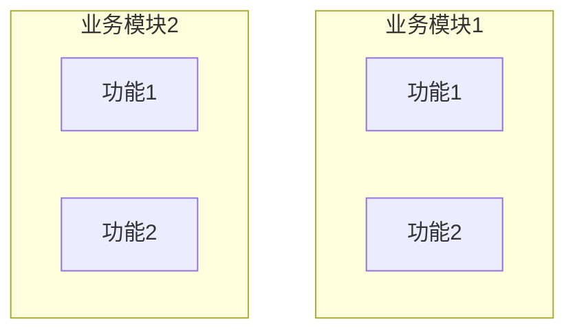
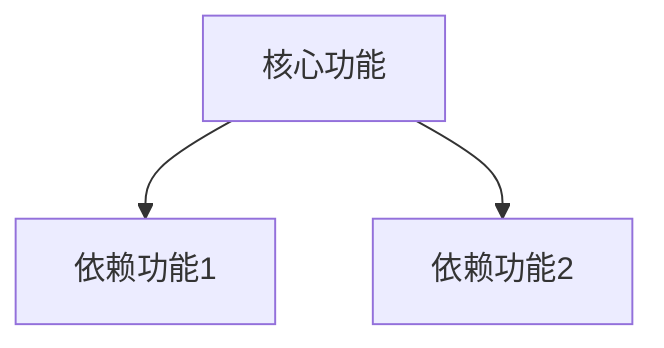
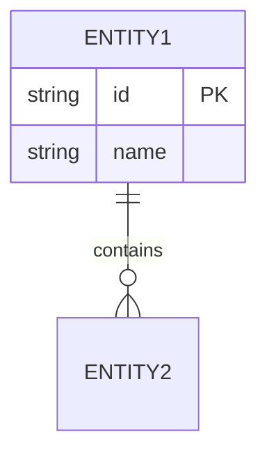

# 项目需求文档

## 项目概述

[项目简介、目的、定位]

## 模块清单

[引用 module_inventory.md]

## 业务全景

### 业务领域

[业务领域描述]

### 业务架构

## 功能全景

### 功能列表

| 模块 | 功能 | 优先级 | 状态 |
|------|------|--------|------|

### 功能依赖

## 业务规则汇总

### 规则统计

| 模块 | 规则数量 | 主要规则类型 |
|------|----------|--------------|

### 规则详情索引

| 模块 | 规则文档位置 |
|------|--------------|

## 数据全景

### 数据实体清单

| 实体 | 属性 | 来源 | 存储位置 |
|------|------|------|----------|

### 数据关系图

### 数据流转图

## 非功能需求

### 性能要求

| 指标 | 要求 | 当前实现 |
|------|------|----------|

### 安全要求

| 要求 | 实现方式 |
|------|----------|

### 可用性要求

| 要求 | 实现方式 |
|------|----------|

### 兼容性要求

| 类型 | 要求 |
|------|------|

## 需求优先级

| 优先级 | 需求 | 理由 |
|--------|------|------|

## 需求缺口分析

### 未实现需求

[代码中未实现但应该有的需求]

### 过实现需求

[代码中实现但实际不需要的需求]

## 附录

### 相关文档

- 模块清单：`docs/requirements/module_inventory.md`
- 设计文档：`docs/deconstruct/global_design.md`
- 数据库设计：`docs/deconstruct/database/database_design.md`
