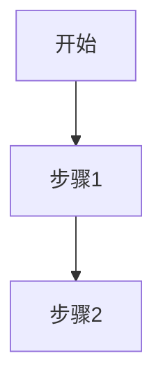
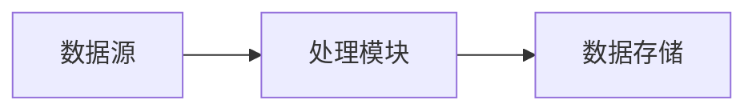

# {模块名称} 需求文档

## 模块概述

[模块简介、在系统中的定位]

## 业务场景

### 场景列表

| 序号 | 场景名称 | 描述 | 优先级 |
|------|----------|------|--------|

### 场景详情

#### 场景1: {场景名称}

**触发条件**：[什么情况下触发]

**业务流程**：

**预期结果**：[期望的结果]

## 功能需求

### 核心功能

| 序号 | 功能名称 | 描述 | 输入 | 输出 |
|------|----------|------|------|------|

### 辅助功能

| 序号 | 功能名称 | 描述 | 输入 | 输出 |
|------|----------|------|------|------|

## 业务规则（深度挖掘）

**[必须包含完整的业务规则章节，不得省略]**

### 规则分类

| 分类 | 规则数量 | 说明 |
|------|----------|------|

### 规则详情

[详见业务规则章节模板]

## 数据需求

### 数据实体

| 实体名称 | 属性列表 | 来源 |
|----------|----------|------|

### 数据流转

## 非功能需求

### 性能要求

[性能指标]

### 安全要求

[安全要求]

## 约束条件

[业务约束、技术约束]
